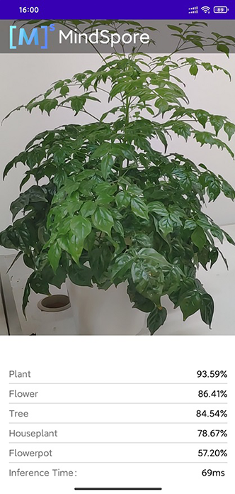

# Image classification

## Image classification introduction

Image classification is to identity what an image represents, to predict the object list and the probabilites. For example，the following tabel shows the classification results after mode inference.

| Category   | Probability |
| ---------- | ----------- |
| plant      | 0.9359      |
| flower     | 0.8641      |
| tree       | 0.8584      |
| houseplant | 0.7867      |

Using MindSpore Lite to realize image classification [example](https://gitee.com/mindspore/mindspore/tree/r1.0/model_zoo/official/lite/image_classification).

## Image classification model list

The following table shows the data of some image classification models using MindSpore Lite inference.

> The performance of the table below is tested on the mate30.

| Model name         | Size(Mb) | Top1 | Top5 | F1 | CPU 4 thread delay (ms) |
|-----------------------| :----------: | :----------: | :----------: | :----------: | :-----------: |
| [MobileNetV2](https://download.mindspore.cn/model_zoo/official/lite/mobilenetv2_openimage_lite/mobilenetv2.ms) | 11.5 | - | - | 65.5% | 14.595 |
| [Inceptionv3](https://download.mindspore.cn/model_zoo/official/lite/inceptionv3_lite/inceptionv3.ms) | 90.9 | 78.62% | 94.08% | - | 92.086 |
| [Shufflenetv2](https://download.mindspore.cn/model_zoo/official/lite/shufflenetv2_lite/shufflenetv2.ms) | 8.8 | 67.74% | 87.62% | - | 8.303 |
| [GoogleNet](https://download.mindspore.cn/model_zoo/official/lite/googlenet_lite/googlenet.ms) | 25.3 | 72.2% | 90.06% | - | 23.257 |
| [ResNext50](https://download.mindspore.cn/model_zoo/official/lite/resnext50_lite/resnext50.ms) | 95.8 | 73.1% | 91.21% | - | 138.164 |
