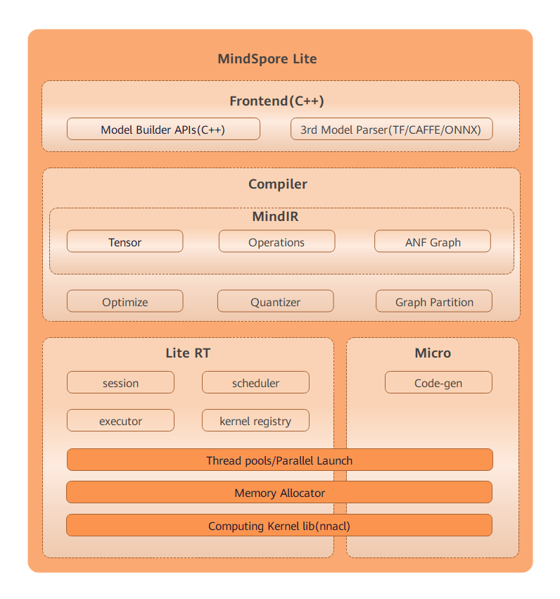

# 总体架构

`Linux` `Windows` `端侧` `推理应用` `中级` `高级` `贡献者`

MindSpore Lite框架的总体架构如下所示：

- **前端（Frontend）：** 负责模型生成，用户可以通过模型构建接口构建模型，将第三方模型和MindSpore训练的模型转换为MindSpore Lite模型，其中第三方模型包括TensorFlow Lite、Caffe 1.0和ONNX模型。

- **IR：** 负责MindSpore的Tensor定义、算子定义和图定义。

- **Backend：** 基于IR进行图优化，包括GHLO、GLLO和量化三部分。其中，GHLO负责和硬件无关的优化，如算子融合、常量折叠等；GLLO负责与硬件相关的优化；量化Quantizer支持权重量化、激活值量化等训练后量化手段。

- **Runtime：** 智能终端的推理运行时，其中session负责会话管理，提供对外接口；线程池和并行原语负责图执行使用的线程池管理，内存分配负责图执行中各个算子的内存复用，算子库提供CPU和GPU算子。 

- **Micro：** IoT设备的运行时，包括模型生成.c文件、线程池、内存复用和算子库。

其中，Runtime和Micro共享底层的算子库、内存分配、线程池、并行原语等基础设施层。 

