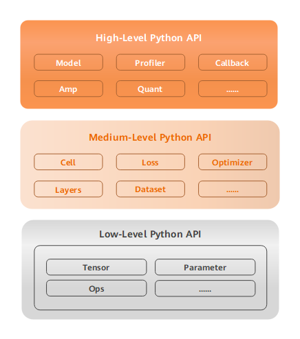

# MindSpore API概述

<!-- TOC -->

- [MindSpore API概述](#mindsporeapi概述)
    - [设计理念](#设计理念)
    - [层次结构](#层次结构)

<!-- /TOC -->

## 设计理念

MindSpore源于全产业的最佳实践，向数据科学家和算法工程师提供了统一的模型训练、推理和导出等接口，支持端、边、云等不同场景下的灵活部署，推动深度学习和科学计算等领域繁荣发展。

神经网络模型通常基于梯度下降算法进行训练，但手动求导过程复杂且梯度难以计算。MindSpore采用函数式可微分编程架构，用户可聚焦于模型算法的数学原生表达，无需进行手动求导。MindSpore的基于源码转换（Source Code Transformation, SCT）的自动微分（Automatic Differentiation）机制能够将Python代码转换为函数中间表达（Intermediate Representation, IR），函数中间表达构造出能够在不同设备解析和执行的计算图，并且在执行该计算图前，应用了多种软硬件协同优化技术，端、边、云等不同场景下的性能和效率得到针对性的提升。此外，MindSpore提供了Python编程范式，用户使用Python原生控制逻辑即可构建复杂的神经网络模型，AI编程变得简单。

目前主流的深度学习框架的执行模式有两种，分别为静态图模式和动态图模式。静态图模式拥有较高的训练性能，但难以调试。动态图模式相较于静态图模式虽然易于调试，但难以高效执行。MindSpore提供了动态图和静态图统一的编码方式。大大增加了静态图和动态图的可兼容性，用户无需开发多套代码，仅变更一行代码便可切换动态图/静态图模式，例如设置`context.set_context(mode=context.PYNATIVE_MODE)`即可从静态图模式切换成动态图模式，从而拥有更轻松的开发调试及性能体验。

随着神经网络模型和数据集的规模不断增加，分布式并行训练成为了神经网络训练的常见做法，但分布式并行训练的策略选择和编写十分复杂，这制约着深度学习的发展。MindSpore统一了单机和分布式训练的编码方式，开发者无需编写复杂的分布式策略，在单机代码中添加少量代码即可实现分布式训练，例如设置`context.set_auto_parallel_context(parallel_mode=ParallelMode.AUTO_PARALLEL)`便可自动建立代价模型，为用户选择一种较优的并行模式，大大降低了AI开发门槛，提高了神经网络训练效率。

## 层次结构

MindSpore向用户提供了3个不同层次的API，支撑用户进行网络构建、整图执行、子图执行以及单算子执行，从低到高分别为Low-Level Python API、Medium-Level Python API以及High-Level Python API。

 

- Low-Level Python API

  第一层为低阶API，主要包括张量定义、基础算子、自动微分等模块，用户可使用低阶API轻松实现张量定义和求导计算，例如用户可通过`Tensor`接口自定义张量，使用`grad_all`算子计算函数在指定处的导数。

- Medium-Level Python API

  第二层为中阶API，其封装了低价API，提供网络层、优化器、损失函数等模块，用户可通过中阶API灵活构建神经网络和控制执行流程，快速实现模型算法逻辑，例如用户可调用`Cell`接口构建神经网络模型和计算逻辑，通过使用`loss`模块和`Optimizer`接口为神经网络模型添加损失函数和优化方式。

- High-Level Python API

  第三层为高阶API，其在中阶API的基础上又提供了训练推理的管理、Callback、混合精度训练等高级接口，方便用户控制整网的执行流程和实现神经网络的训练及推理，例如用户使用`Model`接口，指定要训练的神经网络模型和相关的训练设置，即可对神经网络模型进行训练。
