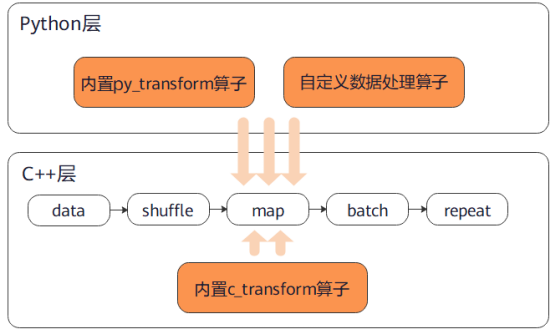

# 数据处理

<!-- TOC -->

- [数据处理](#数据处理)
    - [概述](#概述)
    - [数据处理算子](#数据处理算子)
        - [shuffle](#shuffle)
        - [map](#map)
        - [batch](#batch)
        - [repeat](#repeat)
        - [zip](#zip)
        - [concat](#concat)
        - [project](#project)

<!-- /TOC -->

<a href="https://gitee.com/mindspore/docs/blob/master/api/source_zh_cn/programming_guide/pipeline.md" target="_blank"></a>

## 概述

数据是深度学习的基础，良好的数据输入可以对整个深度神经网络训练起到非常积极的作用。在训练前对已加载的数据集进行数据处理，可以解决诸如数据量过大、样本分布不均等问题，从而获得更加优化的数据输入。

MindSpore的各个数据集类都为用户提供了多种数据处理算子，用户可以构建数据处理pipeline定义需要使用的数据处理操作，数据即可在训练过程中像水一样源源不断地经过数据处理pipeline流向训练系统。

MindSpore目前支持的常用数据处理算子如下表所示，更多数据处理操作参见[API文档](https://www.mindspore.cn/api/zh-CN/master/api/python/mindspore/mindspore.dataset.html)。

| 数据处理算子  | 算子说明 |
| ----  | ----           |
| shuffle | 对数据集进行混洗，随机打乱数据顺序。 |
| map | 提供自定义函数或算子，作用于数据集的指定列数据。 |
| batch | 对数据集进行分批，可以减少训练轮次，加速训练过程。 |
| repeat | 对数据集进行重复，达到扩充数据量的目的。 |
| zip | 将两个数据集进行列拼接，合并为一个数据集。 |
| concat | 将两个数据集进行行拼接，合并为一个数据集。 |
| project | 对数据集列进行映射，将指定列按顺序保留，其余列丢弃。 |

## 数据处理算子

### shuffle

对数据集进行混洗，随机打乱数据顺序。

>设定的`buffer_size`越大，混洗程度越大，但时间、计算资源消耗也会更大。


```python
# 将数据集进行混洗操作

import numpy as np
import mindspore.dataset as ds

# 设置全局随机种子，确保shuffle的行为可预测
ds.config.set_seed(0)

# 构建一个generator
def generator_func():
    for i in range(5):
        yield (np.array([i, i+1, i+2]),)

# 从generator中构建数据管道
dataset1 = ds.GeneratorDataset(generator_func, ["data"])

# 为数据集创建一个混洗操作
# buffer_size代表创建一个存放size个样本的容器，再从此容器中随机采样样本进行输出
# 当buffer_size设置为dataset的长度时，是全局混洗
dataset1 = dataset1.shuffle(buffer_size=2)
for data in dataset1.create_dict_iterator():
    print(data)
```

```
{'data': Tensor(shape=[3], dtype=Int64, value= [0, 1, 2])}
{'data': Tensor(shape=[3], dtype=Int64, value= [2, 3, 4])}
{'data': Tensor(shape=[3], dtype=Int64, value= [3, 4, 5])}
{'data': Tensor(shape=[3], dtype=Int64, value= [1, 2, 3])}
{'data': Tensor(shape=[3], dtype=Int64, value= [4, 5, 6])}
```

### map

将指定的函数或算子作用于数据集的指定列数据，实现数据映射操作。用户可以自定义映射函数，也可以直接使用c_transforms或py_transforms中的算子针对图像、文本数据进行数据增强。

>更多数据增强的使用说明，参见编程指南中[数据增强](https://www.mindspore.cn/api/zh-CN/master/programming_guide/augmentation.html)章节。



```python
# 将数据集进行映射操作

import numpy as np
import mindspore.dataset as ds

# 构建一个generator
def generator_func():
    for i in range(5):
        yield (np.array([i, i+1, i+2]),)

def pyfunc(x):
    return x*2

# 从generator中构建数据管道
dataset = ds.GeneratorDataset(generator_func, ["data"])

# 创建数据管道，输出原始数据
for data in dataset.create_dict_iterator():
    print(data)

print("")

# 为数据集创建一个映射操作
# input_columns指定要处理的列，operation指定映射函数
dataset = dataset.map(operations=pyfunc, input_columns=["data"])

# 创建数据管道，输出映射后的数据
for data in dataset.create_dict_iterator():
    print(data)
```

```
{'data': Tensor(shape=[3], dtype=Int64, value= [0, 1, 2])}
{'data': Tensor(shape=[3], dtype=Int64, value= [1, 2, 3])}
{'data': Tensor(shape=[3], dtype=Int64, value= [2, 3, 4])}
{'data': Tensor(shape=[3], dtype=Int64, value= [3, 4, 5])}
{'data': Tensor(shape=[3], dtype=Int64, value= [4, 5, 6])}

{'data': Tensor(shape=[3], dtype=Int64, value= [0, 2, 4])}
{'data': Tensor(shape=[3], dtype=Int64, value= [2, 4, 6])}
{'data': Tensor(shape=[3], dtype=Int64, value= [4, 6, 8])}
{'data': Tensor(shape=[3], dtype=Int64, value= [ 6,  8, 10])}
{'data': Tensor(shape=[3], dtype=Int64, value= [ 8, 10, 12])}
```

### batch

将数据集分批，分别输入到训练系统中进行训练，可以减少训练轮次，达到加速训练过程的目的。


```python
# 将数据集进行分批操作

import numpy as np
import mindspore.dataset as ds

# 构建一个generator
def generator_func():
    for i in range(5):
        yield (np.array([i, i+1, i+2]),)

# 从generator中构建数据管道
dataset1 = ds.GeneratorDataset(generator_func, ["data"])

# 为数据集划分批次，batch_size代表每2个样本为一个批次
# drop_remainder代表是否丢弃最后不能完整构成批次的样本
# 在此例子中，5%2=1，但因为drop_remainder=False，因此保留最后一个单独的样本
dataset1 = dataset1.batch(batch_size=2, drop_remainder=False)
for data in dataset1.create_dict_iterator():
    print(data)

print("")

# 从generator中构建数据管道
dataset2 = ds.GeneratorDataset(generator_func, ["data"])

# 丢弃最后不能完整构成批次的样本
dataset2 = dataset2.batch(batch_size=2, drop_remainder=True)
for data in dataset2.create_dict_iterator():
    print(data)
```

```
{'data': Tensor(shape=[2, 3], dtype=Int64, value= [[0, 1, 2], [1, 2, 3]])}
{'data': Tensor(shape=[2, 3], dtype=Int64, value= [[2, 3, 4], [3, 4, 5]])}
{'data': Tensor(shape=[1, 3], dtype=Int64, value= [[4, 5, 6]])}

{'data': Tensor(shape=[2, 3], dtype=Int64, value= [[0, 1, 2], [1, 2, 3]])}
{'data': Tensor(shape=[2, 3], dtype=Int64, value= [[2, 3, 4], [3, 4, 5]])}
```

### repeat

对数据集进行重复，达到扩充数据量的目的。

>`repeat`和`batch`操作的顺序会影响训练batch的数量，建议将`repeat`置于`batch`之后。


```python
# 将数据集进行加倍操作

import numpy as np
import mindspore.dataset as ds

# 构建一个generator
def generator_func():
    for i in range(5):
        yield (np.array([i, i+1, i+2]),)

# 从generator中构建数据管道
dataset1 = ds.GeneratorDataset(generator_func, ["data"])

# 为数据集创建一个加倍操作
# count参数代表将数据集内容扩充为原来的count倍
dataset1 = dataset1.repeat(count=2)
for data in dataset1.create_dict_iterator():
    print(data)
```

```
{'data': Tensor(shape=[3], dtype=Int64, value= [0, 1, 2])}
{'data': Tensor(shape=[3], dtype=Int64, value= [1, 2, 3])}
{'data': Tensor(shape=[3], dtype=Int64, value= [2, 3, 4])}
{'data': Tensor(shape=[3], dtype=Int64, value= [3, 4, 5])}
{'data': Tensor(shape=[3], dtype=Int64, value= [4, 5, 6])}
{'data': Tensor(shape=[3], dtype=Int64, value= [0, 1, 2])}
{'data': Tensor(shape=[3], dtype=Int64, value= [1, 2, 3])}
{'data': Tensor(shape=[3], dtype=Int64, value= [2, 3, 4])}
{'data': Tensor(shape=[3], dtype=Int64, value= [3, 4, 5])}
{'data': Tensor(shape=[3], dtype=Int64, value= [4, 5, 6])}
```

### zip

将两个数据集进行列拼接，合并为一个数据集。

>如果两个数据集的列名相同，则不会合并，请注意列的命名。<br>
  如果两个数据集的行数不同，合并后的行数将和较小行数保持一致。

  

```python
# 将数据集进行合并操作

import numpy as np
import mindspore.dataset as ds

# 构建一个generator
def generator_func():
    for i in range(7):
        yield (np.array([i, i+1, i+2]),)

# 构建另一个generator
def generator_func2():
    for i in range(4):
        yield (np.array([1, 2]),)

# 从generator中构建数据管道
dataset1 = ds.GeneratorDataset(generator_func, ["data1"])
dataset2 = ds.GeneratorDataset(generator_func2, ["data2"])

# 为数据集创建一个合并操作
# 新的dataset3会拥有2个列名，分别为data1，data2，同时因为data2的数据较少，会与data2的数据长度对齐
dataset3 = ds.zip((dataset1, dataset2))

for data in dataset3.create_dict_iterator():
    print(data)
```

```
{'data1': Tensor(shape=[3], dtype=Int64, value= [0, 1, 2]), 'data2': Tensor(shape=[2], dtype=Int64, value= [1, 2])}
{'data1': Tensor(shape=[3], dtype=Int64, value= [1, 2, 3]), 'data2': Tensor(shape=[2], dtype=Int64, value= [1, 2])}
{'data1': Tensor(shape=[3], dtype=Int64, value= [2, 3, 4]), 'data2': Tensor(shape=[2], dtype=Int64, value= [1, 2])}
{'data1': Tensor(shape=[3], dtype=Int64, value= [3, 4, 5]), 'data2': Tensor(shape=[2], dtype=Int64, value= [1, 2])}
```

### concat

将两个数据集进行行拼接，合并为一个数据集。

>输入数据集中的列名，列数据类型和列数据的排列应相同。


```python
# 将数据集进行连接操作

import numpy as np
import mindspore.dataset as ds

# 构建一个generator
def generator_func():
    for i in range(2):
        yield (np.array([0, 0, 0]),)

# 构建另一个generator
def generator_func2():
    for i in range(2):
        yield (np.array([1, 2, 3]),)

# 从generator中构建数据管道
dataset1 = ds.GeneratorDataset(generator_func, ["data1"])
dataset2 = ds.GeneratorDataset(generator_func2, ["data1"])

# 为数据集创建一个连接操作，将dataset2合并到dataset1的data1列中
dataset3 = dataset1.concat(dataset2)

# 值得一提的是，使用'+'运算符可以达到上面同样的效果
# dataset3 = dataset1 + dataset2

for data in dataset3.create_dict_iterator():
    print(data)

```

```
{'data1': Tensor(shape=[3], dtype=Int64, value= [0, 0, 0])}
{'data1': Tensor(shape=[3], dtype=Int64, value= [0, 0, 0])}
{'data1': Tensor(shape=[3], dtype=Int64, value= [1, 2, 3])}
{'data1': Tensor(shape=[3], dtype=Int64, value= [1, 2, 3])}
```

### project

对数据集列进行映射，将指定列按顺序保留并向下传递到数据管道中，其余列将被丢弃。

>`project`还可以用于改变column排列的顺序！


```python
# 将数据集进行投影操作

import numpy as np
import mindspore.dataset as ds

# 构建一个generator
def generator_func():
    for i in range(2):
        yield (np.array([1, 2, 3]), np.array([7, 8, 9]), )

# 从generator中构建数据管道
dataset = ds.GeneratorDataset(generator_func, ["data1", "data2"])

# 构建数据管道，获得原始数据
for data in dataset.create_dict_iterator():
    print(data)

print("")

# 为数据集创建一个投影操作，只保留data1的数据
dataset = dataset.project(columns=["data1"])

# 构建数据管道，获得投影后的数据
for data in dataset.create_dict_iterator():
    print(data)
```

```
{'data1': Tensor(shape=[3], dtype=Int64, value= [1, 2, 3]), 'data2': Tensor(shape=[3], dtype=Int64, value= [7, 8, 9])}
{'data1': Tensor(shape=[3], dtype=Int64, value= [1, 2, 3]), 'data2': Tensor(shape=[3], dtype=Int64, value= [7, 8, 9])}

{'data1': Tensor(shape=[3], dtype=Int64, value= [1, 2, 3])}
{'data1': Tensor(shape=[3], dtype=Int64, value= [1, 2, 3])}
```
