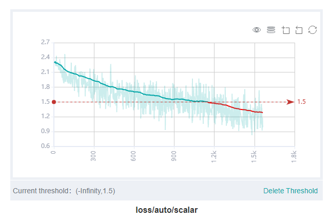
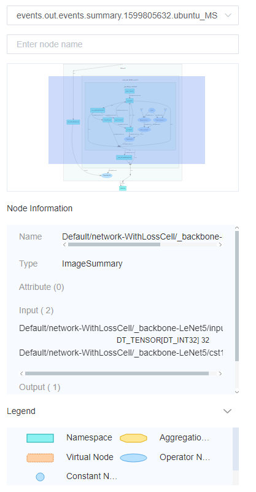
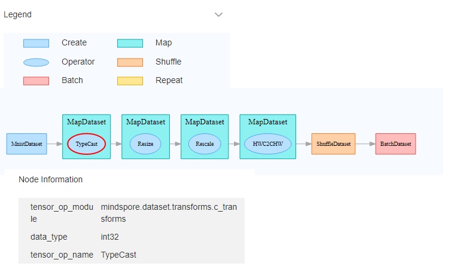
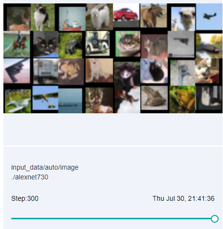
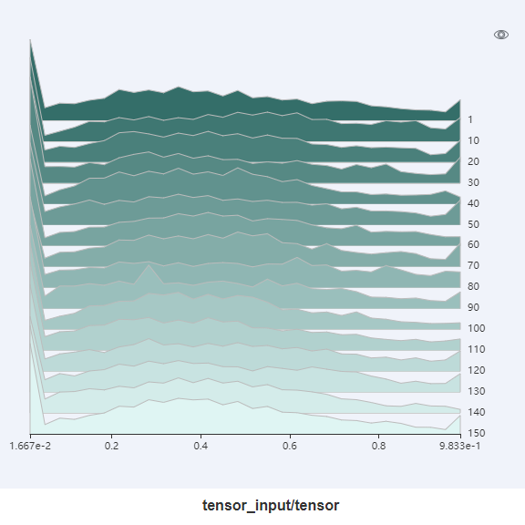

# Dashboard and Lineage

<!-- TOC -->

- [Dashboard and Lineage](#dashboard-and-lineage)
    - [Overview](#overview)
    - [Operation Process](#operation-process)
    - [Preparing the Training Script](#preparing-the-training-script)
        - [Collect Summary Data](#collect-summary-data)
        - [Notices](#Notices)
    - [Visualization Components](#visualization-components)
        - [Training Dashboard](#training-dashboard)
            - [Scalar Visualization](#scalar-visualization)
            - [Parameter Distribution Visualization](#parameter-distribution-visualization)
            - [Computational Graph Visualization](#computational-graph-visualization)
            - [Dataset Graph Visualization](#dataset-graph-visualization)
            - [Image Visualization](#image-visualization)
            - [Tensor Visualization](#tensor-visualization)
        - [Model Lineage](#model-lineage)
        - [Dataset Lineage](#dataset-lineage)
        - [Scalars Comparision](#scalars-comparision)
    - [Specifications](#specifications)

<!-- /TOC -->

<a href="https://gitee.com/mindspore/docs/blob/master/tutorials/source_en/advanced_use/dashboard_and_lineage.md" target="_blank"></a>

## Overview
Scalars, images, computational graphs, and model hyperparameters during training are recorded in files and can be viewed on the web page.

## Operation Process

- Prepare a training script, specify scalars, images, computational graphs, and model hyperparameters in the training script, record them in the summary log file, and run the training script.
- Start MindInsight and specify the summary log file directory using startup parameters. After MindInsight is started, access the visualization page based on the IP address and port number. The default access IP address is `http://127.0.0.1:8080`.
- During the training, when data is written into the summary log file, you can view the data on the web page.

## Preparing the Training Script

### Collect Summary Data

Currently, MindSpore supports to save scalars, images, computational graph, and model hyperparameters to summary log file and display them on the web page.

MindSpore currently supports three ways to record data into summary log file.

**Method one: Automatically collected through `SummaryCollector`**

The `Callback` mechanism in MindSpore provides a quick and easy way to collect common information, including the calculational graph, loss value, learning rate, parameter weights, etc. It is named 'SummaryCollector'.

When you write a training script, you just instantiate the `SummaryCollector` and apply it to either `model.train` or `model.eval`. You can automatically collect some common summary data. `SummaryCollector` detailed usage can reference `API` document `mindspore.train.callback.SummaryCollector`.

The sample code is as follows:
```python
import mindspore.nn as nn
from mindspore import context
from mindspore import Tensor
from mindspore.train import Model
from mindspore.common.initializer import TruncatedNormal
from mindspore.ops import operations as P
from mindspore.train.callback import SummaryCollector

"""AlexNet initial."""
def conv(in_channels, out_channels, kernel_size, stride=1, padding=0, pad_mode="valid"):
    weight = weight_variable()
    return nn.Conv2d(in_channels, out_channels,
                     kernel_size=kernel_size, stride=stride, padding=padding,
                     weight_init=weight, has_bias=False, pad_mode=pad_mode)

def fc_with_initialize(input_channels, out_channels):
    weight = weight_variable()
    bias = weight_variable()
    return nn.Dense(input_channels, out_channels, weight, bias)

def weight_variable():
    return TruncatedNormal(0.02)  # 0.02


class AlexNet(nn.Cell):
    def __init__(self, num_classes=10, channel=3):
        super(AlexNet, self).__init__()
        self.conv1 = conv(channel, 96, 11, stride=4)
        self.conv2 = conv(96, 256, 5, pad_mode="same")
        self.conv3 = conv(256, 384, 3, pad_mode="same")
        self.conv4 = conv(384, 384, 3, pad_mode="same")
        self.conv5 = conv(384, 256, 3, pad_mode="same")
        self.relu = nn.ReLU()
        self.max_pool2d = P.MaxPool(ksize=3, strides=2)
        self.flatten = nn.Flatten()
        self.fc1 = fc_with_initialize(6*6*256, 4096)
        self.fc2 = fc_with_initialize(4096, 4096)
        self.fc3 = fc_with_initialize(4096, num_classes)

    def construct(self, x):
        x = self.conv1(x)
        x = self.relu(x)
        x = self.max_pool2d(x)
        x = self.conv2(x)
        x = self.relu(x)
        x = self.max_pool2d(x)
        x = self.conv3(x)
        x = self.relu(x)
        x = self.conv4(x)
        x = self.relu(x)
        x = self.conv5(x)
        x = self.relu(x)
        x = self.max_pool2d(x)
        x = self.flatten(x)
        x = self.fc1(x)
        x = self.relu(x)
        x = self.fc2(x)
        x = self.relu(x)
        x = self.fc3(x)
        return x

context.set_context(mode=context.GRAPH_MODE)

network = AlexNet(num_classes=10)
loss = nn.SoftmaxCrossEntropyWithLogits(is_grad=False, sparse=True, reduction="mean")
lr = Tensor(0.1)
opt = nn.Momentum(network.trainable_params(), lr, momentum=0.9)
model = Model(network, loss, opt)
ds_train = create_dataset('./dataset_path')

# Init a SummaryCollector callback instance, and use it in model.train or model.eval
summary_collector = SummaryCollector(summary_dir='./summary_dir', collect_freq=1)

# Note: dataset_sink_mode should be set to False, else you should modify collect freq in SummaryCollector
model.train(epoch=1, ds_train, callbacks=[summary_collector], dataset_sink_mode=False)

ds_eval = create_dataset('./dataset_path')
model.eval(ds_eval, callbacks=[summary_collector])
```

**Method two: Custom collection of network data with summary operators and SummaryCollector**

In addition to providing the `SummaryCollector` that automatically collects some summary data, MindSpore provides summary operators that enable custom collection other data on the network, such as the input of each convolutional layer, or the loss value in the loss function, etc. The recording method is shown in the following steps.

Step 1: Call the summary operator in the `construct` function of the derived class that inherits `nn.Cell` to collect image or scalar data.

For example, when a network is defined, image data is recorded in `construct` of the network. When the loss function is defined, the loss value is recorded in `construct` of the loss function.

Record the dynamic learning rate in `construct` of the optimizer when defining the optimizer.

The sample code is as follows:

```python
from mindspore import context, Tensor, nn
from mindspore.common import dtype as mstype
from mindspore.ops import operations as P
from mindspore.ops import functional as F
from mindspore.nn import Optimizer


class CrossEntropyLoss(nn.Cell):
    """Loss function definition."""
    def __init__(self):
        super(CrossEntropyLoss, self).__init__()
        self.cross_entropy = P.SoftmaxCrossEntropyWithLogits()
        self.mean = P.ReduceMean()
        self.one_hot = P.OneHot()
        self.on_value = Tensor(1.0, mstype.float32)
        self.off_value = Tensor(0.0, mstype.float32)

        # Init ScalarSummary
        self.sm_scalar = P.ScalarSummary()

    def construct(self, logits, label):
        label = self.one_hot(label, F.shape(logits)[1], self.on_value, self.off_value)
        loss = self.cross_entropy(logits, label)[0]
        loss = self.mean(loss, (-1,))

        # Record loss
        self.sm_scalar("loss", loss)
        return loss


class MyOptimizer(Optimizer):
    """Optimizer definition."""
    def __init__(self, learning_rate, params, ......):
        ......
        # Initialize ScalarSummary
        self.sm_scalar = P.ScalarSummary()
        self.histogram_summary = P.HistogramSummary()
        self.weight_names = [param.name for param in self.parameters]

    def construct(self, grads):
        ......
        # Record learning rate here
        self.sm_scalar("learning_rate", learning_rate)

        # Record weight
        self.histogram_summary(self.weight_names[0], self.paramters[0])
        # Record gradient
        self.histogram_summary(self.weight_names[0] + ".gradient", grads[0])
        
        ......


class Net(nn.Cell):
    """Net definition."""
    def __init__(self):
        super(Net, self).__init__()
        ......

        # Init ImageSummary
        self.sm_image = P.ImageSummary()
        # Init TensorSummary
        self.sm_tensor = P.TensorSummary()

    def construct(self, data):
        # Record image by Summary operator
        self.sm_image("image", data)
        # Record tensor by Summary operator
        self.sm_tensor("tensor", data)
        ......
        return out
```

Step 2: In the training script, instantiate the `SummaryCollector` and apply it to `model.train`.

The sample code is as follows:

```python
from mindspore import Model, nn, context
from mindspore.train.callback import SummaryCollector

context.set_context(mode=context.GRAPH_MODE)
net = Net()
loss_fn = CrossEntropyLoss()
optim = MyOptimizer(learning_rate=0.01, params=network.trainable_params())
model = Model(net, loss_fn=loss_fn, optimizer=optim, metrics=None)

train_ds = create_mindrecord_dataset_for_training()

summary_collector = SummaryCollector(summary_dir='./summary_dir', collect_freq=1)
model.train(epoch=2, train_ds, callbacks=[summary_collector])
```

**Method three: Custom callback recording data**

MindSpore supports custom callback and support to record data into summary log file
in custom callback, and display the data by the web page.

The following pseudocode is shown in the CNN network, where developers can use the network output with the original tag and the prediction tag to generate the image of the confusion matrix.
It is then recorded into the summary log file through the `SummaryRecord` module.
`SummaryRecord` detailed usage can reference `API` document `mindspore.train.summary.SummaryRecord`.

The sample code is as follows:

```
from mindspore.train.callback import Callback
from mindspore.train.summary import SummaryRecord

class ConfusionMatrixCallback(Callback):
    def __init__(self, summary_dir):
        self._summary_dir = summary_dir
    
    def __enter__(self):
        # init you summary record in here, when the train script run, it will be inited before training
        self.summary_record = SummaryRecord(summary_dir)
    
    def __exit__(self, *exc_args):
        # Note: you must close the summary record, it will release the process pool resource
        # else your training script will not exit from training.
        self.summary_record.close()
        return self

    def step_end(self, run_context):
        cb_params = run_context.run_context.original_args()

        # create a confusion matric image, and record it to summary file
        confusion_martrix = create_confusion_matrix(cb_params)        
        self.summary_record.add_value('image', 'confusion_matrix', confusion_matric)
        self.summary_record.record(cb_params.cur_step)

# init you train script
...

confusion_martrix = ConfusionMartrixCallback(summary_dir='./summary_dir')
model.train(cnn_network, callbacks=[confusion_martrix])
```

The above three ways, support the record computational graph, loss value and other data. In addition, MindSpore also supports the saving of computational graph for other phases of training, through
the `save_graphs` option of `context.set_context` in the training script is set to `True` to record computational graphs of other phases, including the computational graph after operator fusion.

In the saved files, `ms_output_after_hwopt.pb` is the computational graph after operator fusion, which can be viewed on the web page.

### Notices

1. Currently MindSpore supports recording computational graph after operator fusion for Ascend 910 AI processor only.

2. When using the Summary operator to collect data in training, 'HistogramSummary' operator affects performance, so please use as little as possible.

3. Multiple `SummaryRecord` instances can not be used at the same time. (`SummaryRecord` is used in `SummaryCollector`)

    If you use two or more instances of `SummaryCollector` in the callback list of 'model.train' or 'model.eval', it is seen as using multiple `SummaryRecord` instances at the same time, and it will cause recoding data fail. 

    If the custom callback use `SummaryRecord`, it can not be used with `SummaryCollector` at the same time.

    Right code:
    ```python3
    ...示例
    summary_collector = SummaryCollecotor('./summary_dir')
    model.train(epoch=2, train_dataset, callbacks=[summary_collector])
    ...
    model.eval(dataset， callbacks=[summary_collector])
    ```

    Wrong code:
    ```python3
    ...
    summary_collector1 = SummaryCollecotor('./summary_dir1')
    summary_collector2 = SummaryCollecotor('./summary_dir2')
    model.train(epoch=2, train_dataset, callbacks=[summary_collector1, summary_collector2])
    ```

    Wrong code:
    ```python3
    ...
    # Note: the 'ConfusionMatrixCallback' is user-defined, and it uses SummaryRecord to record data.
    confusion_callback = ConfusionMatrixCallback('./summary_dir1')
    summary_collector = SummaryCollecotor('./summary_dir2')
    model.train(epoch=2, train_dataset, callbacks=[confusion_callback, summary_collector])
    ```
4. Since tensor visualizatioin (`TensorSummary`) records raw tensor data, it requires a large amount of storage space. Before using `TensorSummary` and during training, please check that the system storage space is sufficient.
   The storage space occupied by the tensor visualizatioin function can be reduced by the following methods:
    1) Avoid using `TensorSummary` to record larger tensor.

    2) Reduce the number of `TensorSummary` operators in the network.

   After using the function, please clean up the training logs that are no longer needed in time to free up disk space.

   Remarks: The method of estimating the space usage of `TensorSummary` is as follows:

   The size of a `TensorSummary` data = the number of values in the tensor * 4 bytes. Assuming that the size of the tensor recorded by `TensorSummary` is 32 * 1 * 256 * 256, then a `TensorSummary` data needs about 32 * 1 * 256 * 256 * 4 bytes = 8,388,608 bytes = 8MiB. Also suppose that the collect_freq of `SummaryCollector` is set to 1, and 50 iterations are trained. Then the required space when recording these 50 sets of data is about 50 * 8 MiB = 400MiB. It should be noted that due to the overhead of data structure and other factors, the actual storage space used will be slightly larger than 400MiB.

5. The training log file is large when using `TensorSummary` because the complete tensor data is recorded. MindInsight needs more time to parse the training log file, please be patient.

## Visualization Components

### Training Dashboard

Access the Training Dashboard by selecting a specific training from the training list.

#### Scalar Visualization

Scalar visualization is used to display the change trend of scalars during training.



Figure 1: Scalar trend chart

Figure 1 shows a change process of loss values during the neural network training. The horizontal coordinate indicates the training step, and the vertical coordinate indicates the loss value.

Buttons from left to right in the upper right corner of the figure are used to display the chart in full screen, switch the Y-axis scale, enable or disable the rectangle selection, roll back the chart step by step, and restore the chart.

- Full-screen Display: Display the scalar curve in full screen. Click the button again to restore it.
- Switch Y-axis Scale: Perform logarithmic conversion on the Y-axis coordinate.
- Enable/Disable Rectangle Selection: Draw a rectangle to select and zoom in a part of the chart. You can perform rectangle selection again on the zoomed-in chart.
- Step-by-step Rollback: Cancel operations step by step after continuously drawing rectangles to select and zooming in the same area.
- Restore Chart: Restore a chart to the original state.

There can set the threshold value to highlight the value or delete the threshold value in the lower right corner of the figure. As shown in the figure, the threshold set is less than 0.3, highlighted in red shows what is below the threshold, and it is intuitive to see the expected data value or some unusual value.


Figure 2: Scalar visualization function area

Figure 2 shows the scalar visualization function area, which allows you to view scalar information by selecting different tags, different dimensions of the horizontal axis, and smoothness.

- Tag: Select the required tags to view the corresponding scalar information.
- Horizontal Axis: Select any of Step, Relative Time, and Absolute Time as the horizontal axis of the scalar curve.
- Smoothness: Adjust the smoothness to smooth the scalar curve.
- Scalar Synthesis: Synthesize two scalar curves and display them in a chart to facilitate comparison between the two curves or view the synthesized chart.


Figure 3: Scalar synthesis of Accuracy and Loss curves

Figure 3 shows the scalar synthesis of the Accuracy and Loss curves. The function area of scalar synthesis is similar to that of scalar visualization. Different from the scalar visualization function area, the scalar synthesis function allows you to select a maximum of two tags at a time to synthesize and display their curves.

#### Parameter Distribution Visualization

The parameter distribution in a form of a histogram displays tensors specified by a user.


Figure 4: Histogram

Figure 4 shows tensors recorded by a user in a form of a histogram. Click the upper right corner to zoom in the histogram.


Figure 5: Function area of the parameter distribution histogram

Figure 5 shows the function area of the parameter distribution histogram, including:

- Tag selection: Select the required tags to view the corresponding histogram.
- Vertical axis: Select any of `Step`, `Relative time`, and `Absolute time` as the data displayed on the vertical axis of the histogram.
- Angle of view: Select either `Front` or `Top`. `Front` view refers to viewing the histogram from the front view. In this case, data between different steps is overlapped. `Top` view refers to viewing the histogram at an angle of 45 degrees. In this case, data between different steps can be presented.  

#### Computational Graph Visualization

Computational graph visualization is used to display the graph structure, data flow direction, and control flow direction of a computational graph. It supports visualization of summary log files and pb files generated by `save_graphs` configuration in `context`.


Figure 6: Computational graph display area

Figure 6 shows the network structure of a computational graph. As shown in the figure, select an operator in the area of the display area. The operator has two inputs and one outputs (the solid line indicates the data flow direction of the operator).



Figure 7: Computational graph function area

Figure 7 shows the function area of the computational graph, including:

- File selection box: View the computational graphs of different files.
- Search box: Enter a node name and press Enter to view the node.
- Thumbnail: Display the thumbnail of the entire network structure. When viewing an extra large image structure, you can view the currently browsed area.
- Node information: Display the basic information of the selected node, including the node name, properties, input node, and output node.
- Legend: Display the meaning of each icon in the computational graph.

#### Dataset Graph Visualization

Dataset graph visualization is used to display data processing and augmentation information of a single model training.



Figure 8: Dataset graph function area

Figure 8 shows the dataset graph function area which includes the following content:

- Legend: Display the meaning of each icon in the data lineage graph.
- Data Processing Pipeline: Display the data processing pipeline used for training. Select a single node in the graph to view details.
- Node Information: Display basic information about the selected node, including names and parameters of the data processing and augmentation operators.

#### Image Visualization

Image visualization is used to display images specified by users.



Figure 9: Image visualization

Figure 9 shows how to view images of different steps by sliding the Step slider.


Figure 10: Image visualization function area

Figure 10 shows the function area of image visualization. You can view image information by selecting different tags, brightness, and contrast.

- Tag: Select the required tags to view the corresponding image information.
- Brightness Adjustment: Adjust the brightness of all displayed images.
- Contrast Adjustment: Adjust the contrast of all displayed images.

#### Tensor Visualization

Tensor visualization is used to display tensors in the form of table and histogram.


Figure 11: Tensor visualization function area

Figure 11 shows the function area of tensor visualization.

- Tag selection: Select the required tags to view the corresponding table data or histogram.
- View: Select `Table` or `Histogram` to display tensor data. In the `Histogram` view, there are the options of `Vertical axis` and `Angle of view`.
- Vertical axis: Select any of `Step`, `Relative time`, and `Absolute time` as the data displayed on the vertical axis of the histogram.
- Angle of view: Select either `Front` or `Top`. `Front` view refers to viewing the histogram from the front view. In this case, data between different steps is overlapped. `Top` view refers to viewing the histogram at an angle of 45 degrees. In this case, data between different steps can be presented.


Figure 12: Table display

Figure 12 shows tensors recorded by a user in a form of a table which includes the following function:

- Click the small square button on the right side of the table to zoom in the table.
- The white box in the table shows the tensor data under which dimension is currently displayed, where the colon `:` represents all values of the current dimension, you can enter the corresponding index or `:` in the box and press `Enter` or click the button of tick on the back to query tensor data for specific dimensions.
   Assuming a certain dimension is 32, the index range is -32 to 31. Note: tensor data from 0 to 2 dimensions can be queried. Tensor data of more than two dimensions is not supported, in other word, the query conditions of more than two colons `:` cannot be set.
- Query the tensor data of a specific step by dragging the hollow circle below the table.



Figure 13: Histogram display

Figure 13 shows tensors recorded by a user in a form of a histogram. Click the upper right corner to zoom in the histogram.

### Model Lineage

Model lineage visualization is used to display the parameter information of all training models.


Figure 14: Model parameter selection area

Figure 14 shows the model parameter selection area, which lists the model parameter tags that can be viewed. You can select required tags to view the corresponding model parameters.


Figure 15: Model lineage function area

Figure 15 shows the model lineage function area, which visualizes the model parameter information. You can select a specific area in the column to display the model information within the area.


Figure 16: Model list

Figure 16 shows all model information in groups. You can sort the model information in ascending or descending order by specified column.

### Dataset Lineage

Dataset lineage visualization is used to display data processing and augmentation information of all model trainings.


Figure 17: Data processing and augmentation operator selection area

Figure 17 shows the data processing and augmentation operator selection area, which lists names of data processing and augmentation operators that can be viewed. You can select required tags to view related parameters.


Figure 18: Dataset lineage function area

Figure 18 shows the dataset lineage function area, which visualizes the parameter information used for data processing and augmentation. You can select a specific area in the column to display the parameter information within the area.


Figure 19: Dataset lineage list

Figure 19 shows the data processing and augmentation information of all model trainings.

> If user filters the model lineage and then switches to the data lineage page, the line chart will show the latest filtered column in model lineage.

### Scalars Comparision

Scalars Comparision can be used to compare scalar curves between multiple trainings


Figure 20: Scalars comparision curve area

Figure 20 shows the scalar curve comparision between multiple trainings. The horizontal coordinate indicates the training step, and the vertical coordinate indicates the scalar value.

Buttons from left to right in the upper right corner of the figure are used to display the chart in full screen, switch the Y-axis scale, enable or disable the rectangle selection, roll back the chart step by step, and restore the chart.

- Full-screen Display: Display the scalar curve in full screen. Click the button again to restore it.
- Switch Y-axis Scale: Perform logarithmic conversion on the Y-axis coordinate.
- Enable/Disable Rectangle Selection: Draw a rectangle to select and zoom in a part of the chart. You can perform rectangle selection again on the zoomed-in chart.
- Step-by-step Rollback: Cancel operations step by step after continuously drawing rectangles to select and zooming in the same area.
- Restore Chart: Restore a chart to the original state.


Figure 21: Scalars comparision function area

Figure 21 shows the scalars comparision function area, which allows you to view scalar information by selecting different trainings or tags, different dimensions of the horizontal axis, and smoothness.

- Training: Select or filter the required trainings to view the corresponding scalar information.
- Tag: Select the required tags to view the corresponding scalar information.
- Horizontal Axis: Select any of Step, Relative Time, and Absolute Time as the horizontal axis of the scalar curve.
- Smoothness: Adjust the smoothness to smooth the scalar curve.

## Specifications

To limit time of listing summaries, MindInsight lists at most 999 summary items.

To limit memory usage, MindInsight limits the number of tags and steps:
- There are 300 tags at most in each training dashboard. Total number of scalar tags, image tags, computation graph tags, parameter distribution(histogram) tags, tensor tags can not exceed 300. Specially, there are 10 computation graph tags at most. When tags exceed limit, MindInsight preserves the most recently processed tags.
- There are 1000 steps at most for each scalar tag in each training dashboard. When steps exceed limit, MindInsight will sample steps randomly to meet this limit.
- There are 10 steps at most for each image tag in each training dashboard. When steps exceed limit, MindInsight will sample steps randomly to meet this limit.
- There are 50 steps at most for each parameter distribution(histogram) tag in each training dashboard. When steps exceed limit, MindInsight will sample steps randomly to meet this limit.
- There are 20 steps at most for each tensor tag in each training dashboard. When steps exceed limit, MindInsight will sample steps randomly to meet this limit.

To ensure performance, MindInsight implements scalars comparision with the cache mechanism and the following restrictions:
- The scalars comparision supports only for trainings in cache. 
- The maximum of 15 latest trainings (sorted by modification time) can be retained in the cache.
- The maximum of 5 trainings can be selected for scalars comparision at the same time.

Since `TensorSummary` will record complete tensor data, the amount of data is usually relatively large. In order to limit memory usage and ensure performance, MindInsight make the following restrictions with the size of tensor and the number of value responsed and displayed on the front end:
- Support tensor containing up to 10 million values.
- In the tensor-visible table view, the maximum number of value responsed to the front end for each step of each label is 100,000.