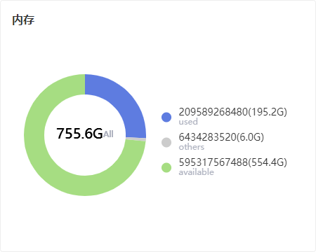

# System Metrics

`Ascend` `Model Optimization` `Intermediate` `Expert`

<!-- TOC -->

- [Overview](#overview)
- [Ascend AI Processor Board](#ascend-ai-processor-board)
- [CPU Board](#cpu-board)
- [Memory Board](#memory-board)

<!-- /TOC -->

## Overview

Users can view system metrics such as Ascend AI processor, CPU, memory, etc., so as to allocate appropriate resources for training.
Just [Start MindInsight](https://www.mindspore.cn/tutorial/en/master/advanced_use/mindinsight_commands.html#start-the-service), and click "System Metrics" in the navigation bar to view it.

## Ascend AI Processor Board

The Ascend AI processor board is used to view the current information of each NPU chip.

Figure 1: System metrics Ascend AI processor board

Figure 1 is a table, each row shows the information of each NPU chip at a certain time. The metrics in each column are as follows:

- **Name**: The name of the chip.
- **NPU**: The chip number, from `0` to `7`.
- **Available**: Whether the chip is available.
- **Health**: The chip health status.
- **IP Address**: The chip IP address.
- **AI Core(%)**: The chip utilization.
- **HBM-Usage(MB)**: The chip used HBM memory.
- **Power(W)**: The chip power.
- **Temp(°C)**: The chip temperature.

> The result of whether the chip is available is for reference only.

## CPU Board

The CPU board is used to view the current system CPU total and the information of each core.

Figure 2: System Metrics CPU board

The two-dimensional table in Figure 2 shows the percentage of CPU utilization for each core; the following two rows show the detailed metrics of *CPU-total* and *CPU-selected*.

- **user**: Time spent by normal processes executing in user mode.
- **system**: Time spent by processes executing in kernel mode
- **idle**: Time spent doing nothing.
- **nice**: Time spent by niced (prioritized) processes executing in user mode.
- **iowait**: Time spent waiting for I/O to complete.
- **irq**: Time spent for servicing hardware interrupts.
- **softirq**: Time spent for servicing software interrupts.
- **steal**: Time spent by other operating systems running in a virtualized environment.
- **guest**: Time spent running a virtual CPU for guest operating systems under the control of the Linux kernel.
- **guest_nice**: Time spent running a niced guest.
- **interrupt**: Time spent for servicing hardware interrupts.
- **dpc**: Time spent servicing deferred procedure calls (DPCs).

> The CPU metrics displayed by different systems may be different.

## Memory Board

The memory board is used to view the current system memory information.

Figure 3: Hardware resource memory board

Figure 3 shows a pie chart showing used memory and available memory. Other memory types are classified into *others*.
