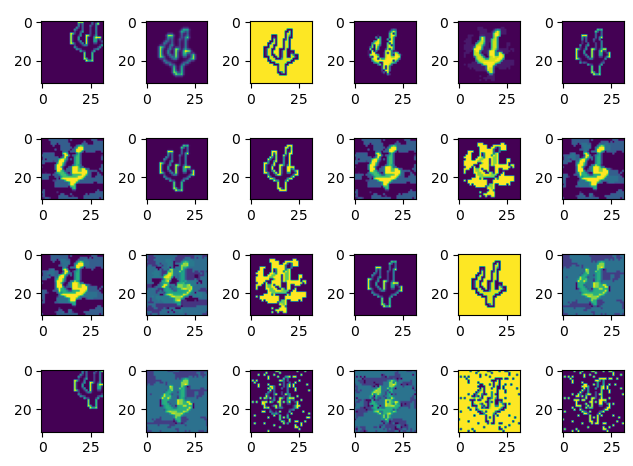

# AI模型安全测试

`Ascend` `GPU` `CPU` `数据准备` `模型开发` `模型训练` `模型调优` `企业` `高级`

<!-- TOC -->

- [AI模型安全测试](#ai模型安全测试)
    - [概述](#概述)
    - [实现阶段](#实现阶段)
        - [导入需要的库文件](#引入相关包)
        - [参数配置](#参数配置)
        - [运用Fuzzer](#运用Fuzzer)
        
<!-- /TOC -->
<a href="https://gitee.com/mindspore/docs/blob/master/tutorials/source_zh_cn/advanced_use/fuzzer.md" target="_blank"></a>&nbsp;&nbsp;

## 概述

传统软件的决策逻辑由代码逻辑决定，传统软件通过代码行覆盖率来判断当前测试是否充分，理想情况下覆盖率越高，代码测试越充分。然而，对于深度神经网络而言，程序的决策逻辑由训练数据、网络模型结构和参数通过某种黑盒机制决定，代码行覆盖率已不足以评估测试的充分性。需要根据深度网络的特点选择更为适合的测试评价准则，指导神经网络进行更为充分的测试，发现更多的边缘错误用例，从而确保模型的通用性、鲁棒性。

MindArmourd的Fuzzer模块以神经元覆盖率作为测试评价准则。神经元覆盖率，是指通过一组输入观察到的、激活的神经元数量和神经元输出值的范围。我们通过神经元覆盖率来指导输入变异，让输入能够激活更多的神经元，神经元值的分布范围更广，从而探索不同类型的模型输出结果、错误行为。

这里以LeNet模型，MNIST数据集为例，说明如何使用Fuzzer。

> 本例面向CPU、GPU、Ascend 910 AI处理器，你可以在这里下载完整的样例代码：<https://gitee.com/mindspore/mindarmour/blob/master/example/mnist_demo/lenet5_mnist_fuzzing.py>

## 实现阶段

### 导入需要的库文件

下列是我们需要的公共模块、MindSpore相关模块和Fuzzer特性模块，以及配置日志标签和日志等级。

```python
import sys

import numpy as np
from mindspore import Model
from mindspore import context
from mindspore.train.serialization import load_checkpoint, load_param_into_net

from lenet5_net import LeNet5
from mindarmour.fuzzing.fuzzing import Fuzzer
from mindarmour.fuzzing.model_coverage_metrics import ModelCoverageMetrics
from mindarmour.utils.logger import LogUtil

LOGGER = LogUtil.get_instance()
TAG = 'Fuzz_test'
LOGGER.set_level('INFO')
```

### 参数配置

配置必要的信息，包括环境信息、执行的模式。

```python
context.set_context(mode=context.GRAPH_MODE, device_target=cfg.device_target)
```

详细的接口配置信息，请参见`context.set_context`接口说明。

### 运用Fuzzer

1. 建立LeNet模型，加载MNIST数据集，操作同[模型安全](<https://www.mindspore.cn/tutorial/zh-CN/master/advanced_use/model_security.html>)

   ```python
   ...
   # Lenet model
   model = Model(net)
   # get training data
   data_list = "./MNIST_unzip/train"
   batch_size = 32
   ds = generate_mnist_dataset(data_list, batch_size, sparse=False)
   train_images = []
   for data in ds.create_tuple_iterator():
       images = data[0].astype(np.float32)
       train_images.append(images)
       train_images = np.concatenate(train_images, axis=0)
   
   # get test data
   data_list = "./MNIST_unzip/test"
   batch_size = 32
   ds = generate_mnist_dataset(data_list, batch_size, sparse=False)
   test_images = []
   test_labels = []
   for data in ds.create_tuple_iterator():
       images = data[0].astype(np.float32)
       labels = data[1]
       test_images.append(images)
       test_labels.append(labels)
   test_images = np.concatenate(test_images, axis=0)
   test_labels = np.concatenate(test_labels, axis=0)
   ```

2. Fuzzer参数配置。

   设置数据变异方法及参数。目前支持的数据变异方法包含三类：

   - 图像仿射变换方法：Translate、Scale、Shear、Rotate。
   - 基于图像像素值变化的方法： Contrast、Brightness、Blur、Noise。
   - 基于对抗攻击的白盒、黑盒对抗样本生成方法：FGSM、PGD、MDIIM。

   数据变异方法一定要包含基于图像像素值变化的方法。

   前两种图像变化方法的可配置参数，以及推荐参数范围请参考：<https://gitee.com/mindspore/mindarmour/blob/master/mindarmour/fuzzing/image_transform.py>对应的类方法，也可以均设置为`'auto_param': True`，变异参数将在推荐范围内随机生成。

   基于对抗攻击方法的参数配置请参考对应的攻击方法类。

   ```python
   mutate_config = [{'method': 'Blur',
                     'params': {'auto_param': True}},
                    {'method': 'Contrast',
                     'params': {'auto_param': True}},
                    {'method': 'Translate',
                     'params': {'auto_param': True}},
                    {'method': 'Brightness',
                     'params': {'auto_param': True}},
                    {'method': 'Noise',
                     'params': {'auto_param': True}},
                    {'method': 'Scale',
                     'params': {'auto_param': True}},
                    {'method': 'Shear',
                     'params': {'auto_param': True}},
                    {'method': 'FGSM',
                     'params': {'eps': 0.3, 'alpha': 0.1}}
                    ]
   ```

   设置评价指标，目前支持5种评价指标，包括:
   - 通用评价指标：accuracy。
   - 神经元覆盖率指标：kmnc， nbc，snac。
   - 对抗攻击评价指标：attack_success_rate。
   也可以设置为‘auto’，默认使用所有评价指标。

   ```python
   eval_metrics =['accuracy', 'kmnc', 'attack_success_rate']
   ```

3. 初始化种子队列，种子队列中的每个种子，包含3个值：原始图片、图片标签、变异标记。变异标记初始化时均为0。

   ```python
   # make initial seeds
   initial_seeds = []
   for img, label in zip(test_images, test_labels):
   	initial_seeds.append([img, label, 0])
   initial_seeds = initial_seeds[:100]
   ```

4. 测试Fuzz测试前的神经元覆盖率。

   ```python
   segmented_num=1000
   neuron_num=10
   model_coverage_test = ModelCoverageMetrics(model, segmented_num, neuron_num, train_images)
   model_coverage_test.calculate_coverage(np.array(test_images[:100]).astype(np.float32))
   LOGGER.info(TAG, 'KMNC of this test is : %s', model_coverage_test.get_kmnc())
   ```

   结果：

   ```python
    KMNC of this test is : 0.0851
   ```

5. Fuzz测试。

   ```python
   model_fuzz_test = Fuzzer(model, train_images, neuron_num, segmented_num)
   _, _, _, _, metrics = model_fuzz_test.fuzzing(mutate_config, initial_seeds, eval_metrics=eval_metrics)
   ```

6. 实验结果。

   ```python
   if metrics:
   	for key in metrics:
       LOGGER.info(TAG, key + ': %s', metrics[key])
   ```

   Fuzz测试后结果如下：

   ```python
   Accuracy: 0.7929
   Attack_success_rate: 0.3939
   Neural_coverage_KMNC: 0.4797
   ```

   Fuzz测试前种子的KMNC神经元覆盖率为8.5%，Fuzz后，KMNC神经元覆盖率为47.97%，神经元覆盖率提升，样本的多样性提升。Fuzz后，模型对于Fuzz生成样本的准确率为96.8%，使用了对抗攻击方法的样本，攻击成功率为79.29%。由于初始化种子、变异方法和相应的参数均为随机选择的，结果有一定的浮动是正常的。

   原始图片：

   

​   Fuzz生成的变异图片：

   