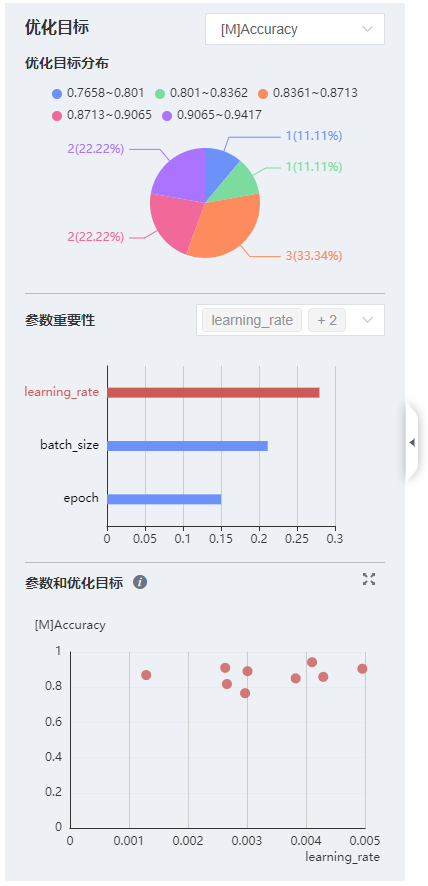

# 溯源和对比看板

`Linux` `Ascend` `GPU` `CPU` `模型调优` `中级` `高级`

<!-- TOC -->

- [溯源和对比看板](#溯源和对比看板)
    - [概述](#概述)
    - [模型溯源](#模型溯源)
    - [数据溯源](#数据溯源)
    - [对比看板](#对比看板)
    - [注意事项](#注意事项)

<!-- /TOC -->

&nbsp;&nbsp;

## 概述

MindInsight中的模型溯源、数据溯源和对比看板同训练看板一样属于可视化组件中的重要组成部分，在对训练数据的可视化中，通过对比看板观察不同标量趋势图发现问题，再使用溯源功能定位问题原因，给用户在数据增强和深度神经网络中提供高效调优的能力。

## 模型溯源

模型溯源可视化用于展示所有训练的模型参数信息。

图1：模型参数选择区

图1展示的模型参数选择区，列举了可供查看的模型参数标签。用户可以通过勾选所需的标签，查看相应的模型参数。

图2：模型溯源功能区

图2展示的模型溯源功能区，图像化展示了模型的参数信息。用户可以通过选择列的特定区域，展示区域范围内的模型信息。

图3：模型列表

图3分组展示所有模型信息，用户可以按指定列进行升序或降序展示模型信息。

左侧概览页展示优化目标和相关参数的信息。

图4：概览页

图4展示的是优化目标分布、参数重要性和散点图。

## 数据溯源

数据溯源可视化用于展示所有训练的数据处理和数据增强信息。

图5：数据处理和增强算子选择区

图5展示的数据处理和数据增强算子选择区，列举了可供查看的数据处理和增强算子的名称。用户可以通过勾选所需的标签，查看相应的参数等信息。

图6：数据溯源功能区

图6展示的数据溯源功能区，图像化展示了数据处理和数据增强使用的参数信息。用户可以通过选择列的特定区域，展示区域范围内的参数信息。

图7：数据溯源列表

图7展示所有模型训练的数据处理和数据增强信息。

> 如果用户筛选模型溯源随后切换到数据溯源页面时，折线图将展示最新一次筛选过的模型溯源列。

## 对比看板

对比看板可视用于多个训练之间的标量曲线对比。

图8: 标量对比曲线图

图8展示了多个训练之间的标量曲线对比效果，横坐标是训练步骤，纵坐标是标量值。

图中右上角有几个按钮功能，从左到右功能分别是全屏展示，切换Y轴比例，开启/关闭框选，分步回退和还原图形。

- 全屏展示即全屏展示该标量曲线，再点击一次即可恢复。
- 切换Y轴比例是指可以将Y轴坐标进行对数转换。
- 开启/关闭框选是指可以框选图中部分区域，并放大查看该区域， 可以在已放大的图形上叠加框选。
- 分步回退是指对同一个区域连续框选并放大查看时，可以逐步撤销操作。
- 还原图形是指进行了多次框选后，点击此按钮可以将图还原回原始状态。

图9：对比看板可视功能区

图9展示的对比看板可视的功能区，提供了根据选择不同训练或标签，水平轴的不同维度和平滑度来进行标量对比的功能。

- 训练: 提供了对所有训练进行多项选择的功能，用户可以通过勾选或关键字筛选所需的训练。
- 标签：提供了对所有标签进行多项选择的功能，用户可以通过勾选所需的标签，查看对应的标量信息。
- 水平轴：可以选择“步骤”、“相对时间”、“绝对时间”中的任意一项，来作为标量曲线的水平轴。
- 平滑度：可以通过调整平滑度，对标量曲线进行平滑处理。

## 注意事项

出于性能上的考虑，MindInsight对比看板使用缓存机制加载训练的标量曲线数据，并进行以下限制：
- 对比看板只支持在缓存中的训练进行比较标量曲线对比。
- 缓存最多保留最新（按修改时间排列）的15个训练。
- 用户最多同时对比5个训练的标量曲线。