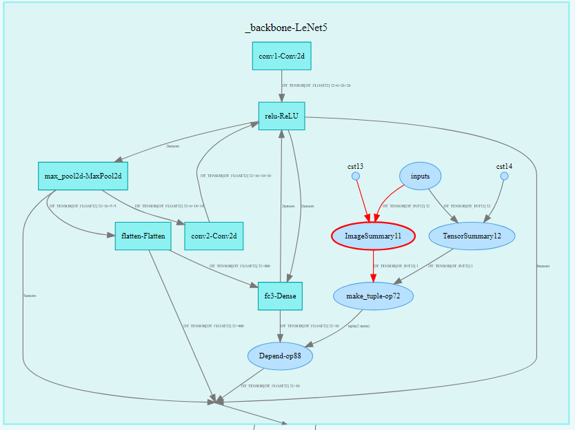
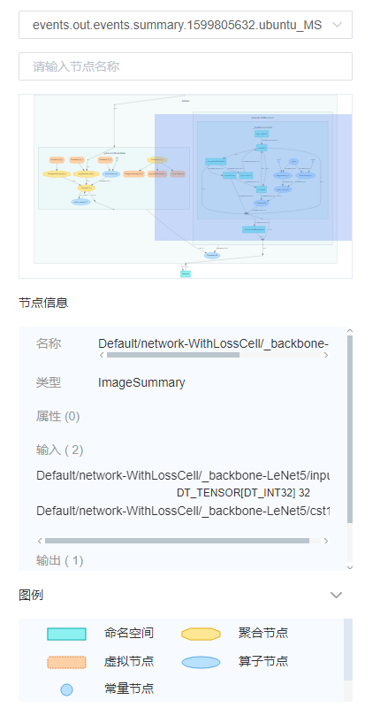

# 训练过程可视

<!-- TOC -->

- [训练过程可视](#训练过程可视)
    - [概述](#概述)
    - [操作流程](#操作流程)
    - [准备训练脚本](#准备训练脚本)
    - [MindInsight相关命令](#mindinsight相关命令)
        - [查看命令帮助信息](#查看命令帮助信息)
        - [查看版本信息](#查看版本信息)
        - [启动服务](#启动服务)
        - [停止服务](#停止服务)
        - [查看服务进程信息](#查看服务进程信息)
    - [可视化组件](#可视化组件)
        - [计算图可视化](#计算图可视化)
        - [标量可视化](#标量可视化)
        - [图像可视化](#图像可视化)
        - [模型溯源可视化](#模型溯源可视化)
        - [数据图可视化](#数据图可视化)
        - [数据溯源可视化](#数据溯源可视化)
        - [参数分布图](#参数分布图)
    - [规格](#规格)

<!-- /TOC -->

[](https://gitee.com/mindspore/docs/blob/master/tutorials/source_zh_cn/advanced_use/visualization_tutorials.md)

## 概述
训练过程中的标量、图像、计算图以及模型超参等信息记录到文件中，通过可视化界面供用户查看。

## 操作流程

- 准备训练脚本，并在训练脚本中指定标量、图像、计算图、模型超参等信息记录到summary日志文件，接着运行训练脚本。
- 启动MindInsight，并通过启动参数指定summary日志文件目录，启动成功后，根据IP和端口访问可视化界面，默认访问地址为 `http://127.0.0.1:8080`。
- 在训练过程中，有数据写入summary日志文件时，即可在页面中查看可视的数据。

## 准备训练脚本

当前MindSpore利用 `Callback` 机制将标量、图像、计算图、模型超参等信息保存到summary日志文件中，并通过可视化界面进行展示。

其中标量、图像是通过Summary算子实现记录数据，计算图是在网络编译完成后，通过 `SummaryRecord` 将其保存到summary日志文件中，
模型参数是通过 `TrainLineage` 或 `EvalLineage` 保存到summary日志文件中。

步骤一：在继承 `nn.Cell` 的衍生类的 `construct` 函数中调用Summary算子来采集图像或标量数据。

比如，在定义网络时，在网络的 `construct` 中记录图像数据；在定义损失函数时，在损失函数的 `construct`中记录损失值。

如果要记录动态学习率，可以在定义优化器时，在优化器的 `construct` 中记录学习率。

样例代码如下：

```python
from mindspore import context, Tensor, nn
from mindspore.common import dtype as mstype
from mindspore.ops import operations as P
from mindspore.ops import functional as F
from mindspore.nn import Optimizer


class CrossEntropyLoss(nn.Cell):
    """Loss function definition."""
    def __init__(self):
        super(CrossEntropyLoss, self).__init__()
        self.cross_entropy = P.SoftmaxCrossEntropyWithLogits()
        self.mean = P.ReduceMean()
        self.one_hot = P.OneHot()
        self.on_value = Tensor(1.0, mstype.float32)
        self.off_value = Tensor(0.0, mstype.float32)

        # Init ScalarSummary
        self.sm_scalar = P.ScalarSummary()

    def construct(self, logits, label):
        label = self.one_hot(label, F.shape(logits)[1], self.on_value, self.off_value)
        loss = self.cross_entropy(logits, label)[0]
        loss = self.mean(loss, (-1,))

        # Record loss
        self.sm_scalar("loss", loss)
        return loss


class MyOptimizer(Optimizer):
    """Optimizer definition."""
    def __init__(self, learning_rate, params, ......):
        ......
        # Initialize ScalarSummary
        self.sm_scalar = P.ScalarSummary()
        self.histogram_summary = P.HistogramSummary()
        self.weight_names = [param.name for param in self.parameters]

    def construct(self, grads):
        ......
        # Record learning rate here
        self.sm_scalar("learning_rate", learning_rate)

        # Record weight
        self.histogram_summary(self.weight_names[0], self.paramters[0])
        # Record gradient
        self.histogram_summary(self.weight_names[0] + ".gradient", grads[0])
        
        ......


class Net(nn.Cell):
    """Net definition."""
    def __init__(self):
        super(Net, self).__init__()
        ......

        # Init ImageSummary
        self.sm_image = P.ImageSummary()

    def construct(self, data):
        # Record image by Summary operator
        self.sm_image("image", data)
        ......
        return out

```

步骤二：通过 `Callback` 的机制，添加所需的Callback实例来指定训练过程中所需要记录的数据。

- `SummaryStep` 用于指定记录summary数据的步骤间隔，每隔指定步骤记录一次数据。

- `TrainLineage` 用于记录模型训练相关的参数信息。

- `EvalLineage` 用于记录模型测试相关的参数信息。

其中，记录计算图需要在调用 `SummaryRecord` 时，指定 `network` 参数，默认不记录。

样例代码如下：

```python
from mindinsight.lineagemgr import TrainLineage, EvalLineage
from mindspore import Model, nn, context
from mindspore.train.callback import SummaryStep
from mindspore.train.summary.summary_record import SummaryRecord


def test_summary():
    # Init context env
    context.set_context(mode=context.GRAPH_MODE, device_target='Ascend')
    # Init hyperparameter
    epoch = 2
    # Init network and Model
    net = Net()
    loss_fn = CrossEntropyLoss()
    optim = MyOptimizer(learning_rate=0.01, params=network.trainable_params())
    model = Model(net, loss_fn=loss_fn, optimizer=optim, metrics=None)

    # Init SummaryRecord and specify a folder for storing summary log files
    # and specify the graph that needs to be recorded
    summary_writer = SummaryRecord(log_dir='./summary', network=net)
    summary_callback = SummaryStep(summary_writer, flush_step=10)

    # Init TrainLineage to record the training information
    train_callback = TrainLineage(summary_writer)

    # Prepare mindrecord_dataset for training
    train_ds = create_mindrecord_dataset_for_training()
    model.train(epoch, train_ds, callbacks=[summary_callback, train_callback])

    # Init EvalLineage to record the evaluation information
    eval_callback = EvalLineage(summary_writer)

    # Prepare mindrecord_dataset for testing
    eval_ds = create_mindrecord_dataset_for_testing()
    model.eval(eval_ds, callbacks=[eval_callback])

    # Note: Make sure to close summary
    summary_writer.close()
```

可以通过脚本中`context`的`save_graphs`选项配置记录算子融合后的计算图。
其中`ms_output_after_hwopt.pb`为算子融合后的计算图。

> - 目前MindSpore仅支持在Ascend 910 AI处理器上导出算子融合后的计算图。
> - 一个batch中，`HistogramSummary`算子的调用次数请尽量控制在10次以下，调用次数越多，性能开销越大。

## MindInsight相关命令

### 查看命令帮助信息

```bash
mindinsight --help
```

### 查看版本信息

```bash
mindinsight --version
```

### 启动服务

```bash
mindinsight start [-h] [--config <CONFIG>] [--workspace <WORKSPACE>]
                  [--port <PORT>] [--reload-interval <RELOAD_INTERVAL>]
                  [--summary-base-dir <SUMMARY_BASE_DIR>]
```
  
参数含义如下:

- `-h, --help` : 显示启动命令的帮助信息。
- `--config <CONFIG>` : 指定配置文件或配置模块，CONFIG为物理文件路径（file:/path/to/config.py）或Python可识别的模块路径（python:path.to.config.module）。
- `--workspace <WORKSPACE>` : 指定工作目录路径，WORKSPACE默认为 $HOME/mindinsight。
- `--port <PORT>` : 指定Web可视化服务端口，取值范围是1~65535，PORT默认为8080。
- `--reload-interval <RELOAD_INTERVAL>` : 指定加载数据的时间间隔（单位：秒），设置为0时表示只加载一次数据，RELOAD_INTERVAL默认为3秒。
- `--summary-base-dir <SUMMARY_BASE_DIR>` : 指定加载训练日志数据的根目录路径，MindInsight将遍历此路径下的直属子目录，查找文件名符合正则表达式'summary.\d+'或'\.pb$'的日志文件。若某个直属子目录包含日志文件，则该子目录被识别为日志文件目录，若根目录包含日志文件，则根目录被识别为日志文件目录。SUMMARY_BASE_DIR默认为当前目录路径。

> 服务启动时，命令行参数值将被保存为进程的环境变量，并以 `MINDINSIGHT_` 开头作为标识，如 `MINDINSIGHT_CONFIG`，`MINDINSIGHT_WORKSPACE`，`MINDINSIGHT_PORT` 等。

### 停止服务

```bash
mindinsight stop [-h] [--port PORT]
```

参数含义如下:

- `-h, --help` : 显示停止命令的帮助信息。
- `--port <PORT>` : 指定Web可视化服务端口，取值范围是1~65535，PORT默认为8080。

### 查看服务进程信息

MindInsight向用户提供Web服务，可通过以下命令，查看当前运行的Web服务进程。

```bash
ps -ef | grep mindinsight
```

根据服务进程PID，可通过以下命令，查看当前服务进程对应的工作目录WORKSPACE。

```bash
lsof -p <PID> | grep access
```

输出如下，可查看WORKSPACE。

```bash
gunicorn  <PID>  <USER>  <FD>  <TYPE>  <DEVICE>  <SIZE/OFF>  <NODE>  <WORKSPACE>/log/gunicorn/access.log
```

## 可视化组件
### 计算图可视化

计算图可视化用于展示计算图的图结构，数据流以及控制流的走向，支持展示summary日志文件与通过`context`的`save_graphs`参数导出的`pb`文件。



图1：计算图展示区

图1展示了计算图的网络结构。如图中所展示的，在展示区中，选中其中一个算子（图中圈红算子），可以看到该算子有两个输入和一个输出（实线代表算子的数据流走向）。



图2：计算图功能区

图2展示了计算图可视化的功能区，包含以下内容：

*  文件选择框: 可以选择查看不同文件的计算图。
*  搜索框：可以对节点进行搜索，输入节点名称点击回车，即可展示该节点。
*  缩略图：展示整个网络图结构的缩略图，在查看超大图结构时，方便查看当前浏览的区域。
*  节点信息：展示选中的节点的基本信息，包括节点的名称、属性、输入节点、输出节点等信息。
*  图例：展示的是计算图中各个图标的含义。

### 标量可视化

标量可视化用于展示训练过程中，标量的变化趋势情况。


图3：标量趋势图

图3展示了神经网络在训练过程中损失值的变化过程。横坐标是训练步骤，纵坐标是损失值。

图中右上角有几个按钮功能，从左到右功能分别是全屏展示，切换Y轴比例，开启/关闭框选，分步回退和还原图形。

- 全屏展示即全屏展示该标量曲线，再点击一次即可恢复。
- 切换Y轴比例是指可以将Y轴坐标进行对数转换。
- 开启/关闭框选是指可以框选图中部分区域，并放大查看该区域， 可以在已放大的图形上叠加框选。
- 分步回退是指对同一个区域连续框选并放大查看时，可以逐步撤销操作。
- 还原图形是指进行了多次框选后，点击此按钮可以将图还原回原始状态。


图4：标量可视化功能区

图4展示的标量可视化的功能区，提供了根据选择不同标签，水平轴的不同维度和平滑度来查看标量信息的功能。

- 标签：提供了对所有标签进行多项选择的功能，用户可以通过勾选所需的标签，查看对应的标量信息。
- 水平轴：可以选择“步骤”、“相对时间”、“绝对时间”中的任意一项，来作为标量曲线的水平轴。
- 平滑度：可以通过调整平滑度，对标量曲线进行平滑处理。
- 标量合成：可以选中两条标量曲线进行合成并展示在一个图中，以方便对两条曲线进行对比或者查看合成后的图。


图5：Accuracy和Loss的标量合成图

图5展示Accuracy曲线和Loss曲线的标量合成图。标量合成的功能区与标量可视化的功能区相似。其中与标量可视化功能区不一样的地方，在于标签选择时，标量合成功能最多只能同时选择两个标签，将其曲线合成并展示。

### 图像可视化

图像可视化用于展示用户所指定的图片。


图6：图像可视化

图6展示通过滑动图中“步骤”滑条，查看不同步骤的图片。


图7：图像可视化功能区

图7展示图像可视化的功能区，提供了选择查看不同标签，不同亮度和不同对比度来查看图片信息。

- 标签：提供了对所有标签进行多项选择的功能，用户可以通过勾选所需的标签，查看对应的图片信息。
- 亮度调整：可以调整所展示的所有图片亮度。
- 对比度调整：可以调整所展示的所有图片对比度。

### 模型溯源可视化

模型溯源可视化用于展示所有训练的模型参数信息。


图8：模型参数选择区

图8展示的模型参数选择区，列举了可供查看的模型参数标签。用户可以通过勾选所需的标签，查看相应的模型参数。


图9：模型溯源功能区

图9展示的模型溯源功能区，图像化展示了模型的参数信息。用户可以通过选择列的特定区域，展示区域范围内的模型信息。


图10：模型列表

图10展示所有模型信息，用户可以按指定列进行升序或降序展示模型信息。

### 数据图可视化

数据图可视化用于展示单次模型训练的数据处理和数据增强信息。


图11：数据图功能区

图11展示的数据图功能区包含以下内容：

*  图例：展示数据溯源图中各个图标的含义。
*  数据处理流水线：展示训练所使用的数据处理流水线，可以选择图中的单个节点查看详细信息。
*  节点信息：展示选中的节点的基本信息，包括使用的数据处理和增强算子的名称、参数等。

### 数据溯源可视化

数据溯源可视化用于展示所有训练的数据处理和数据增强信息。


图12：数据处理和增强算子选择区

图12展示的数据处理和数据增强算子选择区，列举了可供查看的数据处理和增强算子的名称。用户可以通过勾选所需的标签，查看相应的参数等信息。


图13：数据溯源功能区

图13展示的数据溯源功能区，图像化展示了数据处理和数据增强使用的参数信息。用户可以通过选择列的特定区域，展示区域范围内的参数信息。


图14：数据溯源列表

图14展示所有模型训练的数据处理和数据增强信息。

### 参数分布图

参数分布图用于将用户所指定的张量以直方图的形式进行展示。


图15: 直方图展示

图15将用户所记录的张量以直方图的形式进行展示。点击图中右上角，可以将图放大。


图16: 参数分布图功能区

图16展示参数分布图的功能区，包含以下内容:

- 标签选择：提供了对所有标签进行多项选择的功能，用户可以通过勾选所需的标签，查看对应的直方图。
- 纵轴：可以选择`步骤`、`相对时间`、`绝对时间`中的任意一项，来作为直方图纵轴显示的数据。
- 视角：可以选择`正视`和`俯视`中的一种。`正视`是指从正面的角度查看直方图，此时不同步骤之间的数据会覆盖在一起。`俯视`是指偏移以45度角俯视直方图区域，这时可以呈现不同步骤之间数据的差异。  

## 规格

为了控制列出summary列表的用时，MindInsight最多支持发现999个summary列表条目。

为了控制内存占用，MindInsight对标签（tag）数目和步骤（step）数目进行了限制：
- 每个训练看板的最大标签数量为300个标签。标量标签、图片标签、计算图标签、参数分布图（直方图）标签的数量总和不得超过300个。特别地，每个训练看板最多有10个计算图标签。当实际标签数量超过这一限制时，将依照MindInsight的处理顺序，保留最近处理的300个标签。
- 每个训练看板的每个标量标签最多有1000个步骤的数据。当实际步骤的数目超过这一限制时，将对数据进行随机采样，以满足这一限制。
- 每个训练看板的每个图片标签最多有10个步骤的数据。当实际步骤的数目超过这一限制时，将对数据进行随机采样，以满足这一限制。
- 每个训练看板的每个参数分布图（直方图）标签最多有50个步骤的数据。当实际步骤的数目超过这一限制时，将对数据进行随机采样，以满足这一限制。
