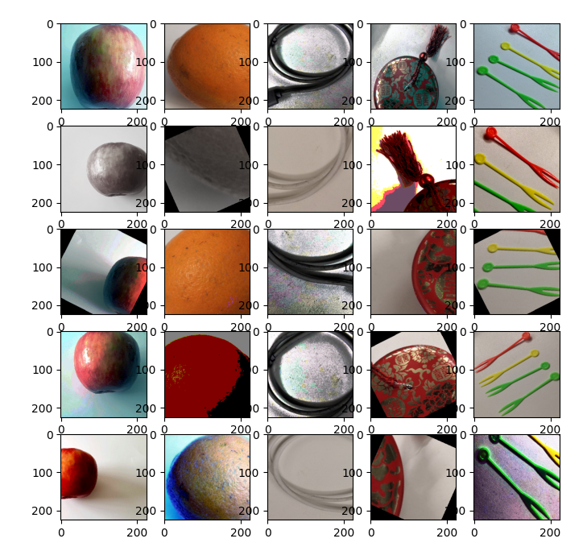

# Auto Augmentation

`Linux` `Ascend` `GPU` `CPU` `Data Preparation` `Intermediate` `Expert`

<!-- TOC depthFrom:1 depthTo:6 withLinks:1 updateOnSave:1 orderedList:0 -->

- [Auto Augmentation](#auto-augmentation)
    - [Overview](#overview)
    - [Auto Augmentation on ImageNet](#auto-augmentation-on-imagenet)
    - [References](#references)

<!-- /TOC -->

<a href="https://gitee.com/mindspore/docs/blob/r1.0/tutorials/training/source_en/advanced_use/enable_auto_augmentation.md" target="_blank"></a>

## Overview

Auto Augmentation [1] finds a suitable image augmentation scheme for a specific dataset by searching through a series of image augmentation sub-policies. The `c_transforms` module of MindSpore provides various C++ operators that are used in Auto Augmentation. User can also customize functions or operators to implement Auto Augmentation. For more details about the MindSpore operators, see the [API document](https://www.mindspore.cn/doc/api_python/en/r1.0/mindspore/mindspore.dataset.vision.html).

The mapping between MindSpore operators and Auto Augmentation operators is as follows:

| Auto Augmentation Operators | MindSpore Operators | Introduction |
|:-------------------:|:------|--------------|
|shearX|RandomAffine|Horizontal Shear|
|shearY|RandomAffine|Vertical Shear|
|translateX|RandomAffine|Horizontal Translation|
|translateY|RandomAffine|Vertival Translation|
|rotate|RandomRotation|Rotational Transformation|
|color|RandomColor|Color Transformation|
|posterize|RandomPosterize|Decrease the number of color channels|
|solarize|RandomSolarize|Invert all pixels within the specified threshold range|
|contrast|RandomColorAdjust|Contrast Adjustment|
|sharpness|RandomSharpness|Sharpness Adjustment|
|brightness|RandomColorAdjust|Brightness Adjustment|
|autocontrast|AutoContrast|Maximize image contrast|
|equalize|Equalize|Equalize image histogram|
|invert|Invert|Image Inversion|

## Auto Augmentation on ImageNet

This tutorial uses the implementation of Auto Augmentation on ImageNet dataset as an example.

The data augmentation policy for ImageNet dataset contains 25 sub-policies, and each sub-policy contains two transforms. A combination of sub-policy is randomly selected for each image in a batch, and each transform in the sub-policy is executed based on a preset probability.

User can use the `RandomSelectSubpolicy` interface of the `c_transforms` module in MindSpore to implement Auto Augmentation. The standard data augmentation method in ImageNet classification training includes the following steps:

- `RandomCropDecodeResize`: Randomly crop then decode.

- `RandomHorizontalFlip`: Randomly flip horizontally.

- `Normalize`: Normalize the data.

- `HWC2CHW`: Change image channel.

Add Auto Augmentation transform after `RandomCropDecodeResize` as follows:

1. Import Mindspore modules.

    ```python
    import mindspore.common.dtype as mstype
    import mindspore.dataset.engine as de
    import mindspore.dataset.vision.c_transforms as c_vision
    import mindspore.dataset.transforms.c_transforms as c_transforms
    import matplotlib.pyplot as plt
    ```

2. Define the mapping from the MindSpore operators to the Auto Augmentation operators.

    ```python
    # define Auto Augmentation operators

    PARAMETER_MAX = 10

    def float_parameter(level, maxval):
        return float(level) * maxval /  PARAMETER_MAX

    def int_parameter(level, maxval):
        return int(level * maxval / PARAMETER_MAX)

    def shear_x(level):
        v = float_parameter(level, 0.3)
        return c_transforms.RandomChoice([c_vision.RandomAffine(degrees=0, shear=(-v,-v)), c_vision.RandomAffine(degrees=0, shear=(v, v))])

    def shear_y(level):
        v = float_parameter(level, 0.3)
        return c_transforms.RandomChoice([c_vision.RandomAffine(degrees=0, shear=(0, 0, -v,-v)), c_vision.RandomAffine(degrees=0, shear=(0, 0, v, v))])

    def translate_x(level):
        v = float_parameter(level, 150 / 331)
        return c_transforms.RandomChoice([c_vision.RandomAffine(degrees=0, translate=(-v,-v)), c_vision.RandomAffine(degrees=0, translate=(v, v))])

    def translate_y(level):
        v = float_parameter(level, 150 / 331)
        return c_transforms.RandomChoice([c_vision.RandomAffine(degrees=0, translate=(0, 0, -v,-v)), c_vision.RandomAffine(degrees=0, translate=(0, 0, v, v))])

    def color_impl(level):
        v = float_parameter(level, 1.8) + 0.1
        return c_vision.RandomColor(degrees=(v, v))

    def rotate_impl(level):
        v = int_parameter(level, 30)
        return c_transforms.RandomChoice([c_vision.RandomRotation(degrees=(-v, -v)), c_vision.RandomRotation(degrees=(v, v))])

    def solarize_impl(level):
        level = int_parameter(level, 256)
        v = 256 - level
        return c_vision.RandomSolarize(threshold=(0, v))

    def posterize_impl(level):
        level = int_parameter(level, 4)
        v = 4 - level
        return c_vision.RandomPosterize(bits=(v, v))

    def contrast_impl(level):
        v = float_parameter(level, 1.8) + 0.1
        return c_vision.RandomColorAdjust(contrast=(v, v))

    def autocontrast_impl(level):
        return c_vision.AutoContrast()

    def sharpness_impl(level):
        v = float_parameter(level, 1.8) + 0.1
        return c_vision.RandomSharpness(degrees=(v, v))

    def brightness_impl(level):
        v = float_parameter(level, 1.8) + 0.1
        return c_vision.RandomColorAdjust(brightness=(v, v))
    ```

3. Define Auto Augmentation policy for ImageNet dataset.

    ```python
    # define Auto Augmentation policy
    imagenet_policy = [
          [(posterize_impl(8), 0.4), (rotate_impl(9), 0.6)],
          [(solarize_impl(5), 0.6), (autocontrast_impl(5), 0.6)],
          [(c_vision.Equalize(), 0.8), (c_vision.Equalize(), 0.6)],
          [(posterize_impl(7), 0.6), (posterize_impl(6), 0.6)],
          [(c_vision.Equalize(), 0.4), (solarize_impl(4), 0.2)],

          [(c_vision.Equalize(), 0.4), (rotate_impl(8), 0.8)],
          [(solarize_impl(3), 0.6), (c_vision.Equalize(), 0.6)],
          [(posterize_impl(5), 0.8), (c_vision.Equalize(), 1.0)],
          [(rotate_impl(3), 0.2), (solarize_impl(8), 0.6)],
          [(c_vision.Equalize(), 0.6), (posterize_impl(6), 0.4)],

          [(rotate_impl(8), 0.8), (color_impl(0), 0.4)],
          [(rotate_impl(9), 0.4), (c_vision.Equalize(), 0.6)],
          [(c_vision.Equalize(), 0.0), (c_vision.Equalize(), 0.8)],
          [(c_vision.Invert(), 0.6), (c_vision.Equalize(), 1.0)],
          [(color_impl(4), 0.6), (contrast_impl(8), 1.0)],

          [(rotate_impl(8), 0.8), (color_impl(2), 1.0)],
          [(color_impl(8), 0.8), (solarize_impl(7), 0.8)],
          [(sharpness_impl(7), 0.4), (c_vision.Invert(), 0.6)],
          [(shear_x(5), 0.6), (c_vision.Equalize(), 1.0)],
          [(color_impl(0), 0.4), (c_vision.Equalize(), 0.6)],

          [(c_vision.Equalize(), 0.4), (solarize_impl(4), 0.2)],
          [(solarize_impl(5), 0.6), (autocontrast_impl(5), 0.6)],
          [(c_vision.Invert(), 0.6), (c_vision.Equalize(), 1.0)],
          [(color_impl(4), 0.6), (contrast_impl(8), 1.0)],
          [(c_vision.Equalize(), 0.8), (c_vision.Equalize(), 0.6)],
        ]
    ```

4. Add Auto Augmentation transforms after `RandomCropDecodeResize` operation.

    ```python
    def create_dataset(dataset_path, do_train, repeat_num=1, batch_size=32, shuffle=True, num_samples=5, target="Ascend"):
      # create a train or eval imagenet2012 dataset for resnet50
      ds = de.ImageFolderDataset(dataset_path, num_parallel_workers=8,
              shuffle=shuffle, num_samples=num_samples)

      image_size = 224
      mean = [0.485 * 255, 0.456 * 255, 0.406 * 255]
      std = [0.229 * 255, 0.224 * 255, 0.225 * 255]

      # define map operations
      if do_train:
          trans = [
                  c_vision.RandomCropDecodeResize(image_size, scale=(0.08, 1.0), ratio=(0.75, 1.333)),
                  ]

          post_trans = [
                  c_vision.RandomHorizontalFlip(prob=0.5),
                  ]
      else:
          trans = [
                  c_vision.Decode(),
                  c_vision.Resize(256),
                  c_vision.CenterCrop(image_size),
                  c_vision.Normalize(mean=mean, std=std),
                  c_vision.HWC2CHW()
                  ]
      ds = ds.map(operations=trans, input_columns="image")
      if do_train:
          ds = ds.map(operations=c_vision.RandomSelectSubpolicy(imagenet_policy), input_columns=["image"])
          ds = ds.map(operations=post_trans, input_columns="image")
      type_cast_op = c_transforms.TypeCast(mstype.int32)
      ds = ds.map(operations=type_cast_op, input_columns="label")
      # apply batch operation
      ds = ds.batch(batch_size, drop_remainder=True)

      # apply repeat operation
      ds = ds.repeat(repeat_num)

      return ds
    ```

5. Verify effects of Auto Augmentation.

    ```python
    # path to imagefolder directory. This directory needs to contain sub-directories which contain the images
    DATA_DIR = "/path/to/imagefolder_directory"
    ds = create_dataset(dataset_path=DATA_DIR, do_train=True, batch_size=5, shuffle=False, num_samples=5)

    epochs = 5
    itr = ds.create_dict_iterator()
    fig=plt.figure(figsize=(8, 8))
    columns = 5
    rows = 5

    step_num = 0
    for ep_num in range(epochs):
        for data in itr:
            step_num += 1
            for index in range(rows):
                fig.add_subplot(rows, columns, ep_num * rows + index + 1)
                plt.imshow(data['image'].asnumpy()[index])
    plt.show()
    ```

    > For better visualization, only five images are read from the dataset without performing `shuffle`, `Normalize`, nor `HWC2CHW` operations.

    

    The images above visualize the effect of Auto Augmentation. The horizontal direction displays five images in one batch, and the vertical direction displays five batches.

## References

[1] [AutoAugment: Learning Augmentation Policies from Data](https://arxiv.org/abs/1805.09501)
