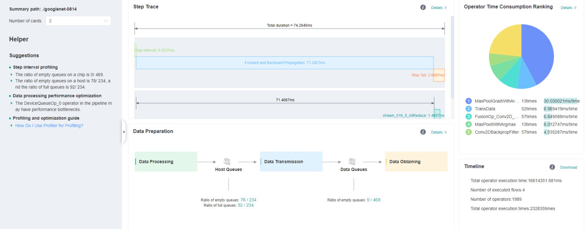
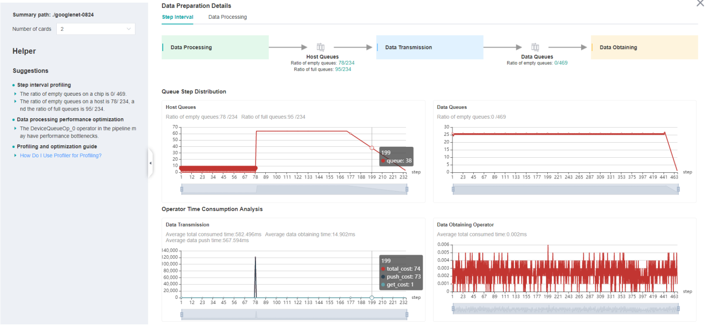
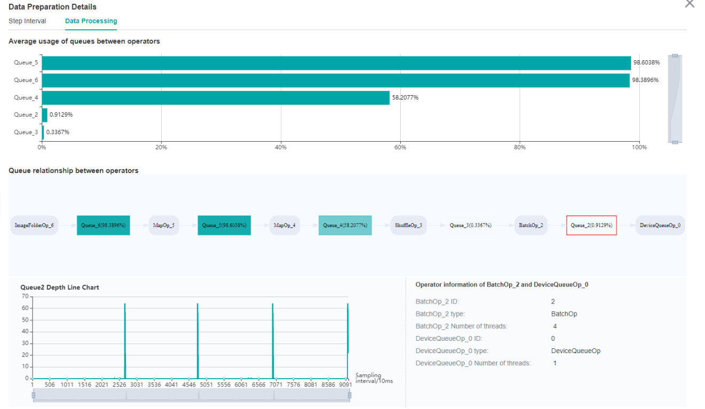

# Performance Profiling(Ascend)

`Linux` `Ascend` `Model Optimization` `Intermediate` `Expert`

<!-- TOC -->

- [Performance Profiling(Ascend)](#performance-profilingascend)
    - [Overview](#overview)
    - [Operation Process](#operation-process)
    - [Preparing the Environment](#preparing-the-environment)
    - [Preparing the Training Script](#preparing-the-training-script)
    - [Launch MindInsight](#launch-mindinsight)
        - [Performance Analysis](#performance-analysis)
            - [Step Trace Analysis](#step-trace-analysis)
            - [Operator Performance Analysis](#operator-performance-analysis)
            - [MindData Performance Analysis](#minddata-performance-analysis)
            - [Timeline Analysis](#timeline-analysis)
    - [Specifications](#specifications)

<!-- /TOC -->

<a href="https://gitee.com/mindspore/docs/blob/master/tutorials/training/source_en/advanced_use/performance_profiling.md" target="_blank"></a>

## Overview
Performance data like operators' execution time is recorded in files and can be viewed on the web page, this can help the user optimize the performance of neural networks.

## Operation Process

- Prepare a training script, add profiler APIs in the training script, and run the training script.
- Start MindInsight and specify the profiler data directory using startup parameters. After MindInsight is started, access the visualization page based on the IP address and port number. The default access IP address is `http://127.0.0.1:8080`.
- Find the training in the list, click the performance profiling link, and view the data on the web page.

## Preparing the Environment

Before using Profiler, make sure the process of ada in background running right. The ada process must using users in HwHiAiUser user group or the root user to run, and run the scripts using the same user. The start command is `/usr/local/Ascend/driver/tools/ada`.

## Preparing the Training Script

To enable the performance profiling of neural networks, MindSpore Profiler APIs should be added into the script. At first, the MindSpore `Profiler` object need to be set after set context and before the network and HCCL initialization. Then, at the end of the training, `Profiler.analyse()` should be called to finish profiling and generate the perforamnce analyse results.

> The parameters of Profiler are as follows：
>
> <https://www.mindspore.cn/doc/api_python/en/master/mindspore/mindspore.profiler.html>

The sample code is as follows:

```python
from mindspore.profiler import Profiler
from mindspore import Model, nn, context


def test_profiler():
    # Init context env
    context.set_context(mode=context.GRAPH_MODE, device_target='Ascend', device_id=int(os.environ["DEVICE_ID"]))
    
    # Init Profiler
    profiler = Profiler()
    
    # Init hyperparameter
    epoch = 2
    # Init network and Model
    net = Net()
    loss_fn = CrossEntropyLoss()
    optim = MyOptimizer(learning_rate=0.01, params=network.trainable_params())
    model = Model(net, loss_fn=loss_fn, optimizer=optim, metrics=None)  
    # Prepare mindrecord_dataset for training
    train_ds = create_mindrecord_dataset_for_training()
    # Model Train
    model.train(epoch, train_ds)
    
    # Profiler end
    profiler.analyse()
```


## Launch MindInsight

The MindInsight launch command can refer to [MindInsight Commands](https://www.mindspore.cn/tutorial/training/en/master/advanced_use/mindinsight_commands.html).


### Performance Analysis

Users can access the Performance Profiler by selecting a specific training from the training list, and click the performance profiling link.



Figure 1：Overall Performance

Figure 1 displays the overall performance of the training, including the overall data of Step Trace, Operator Performance, MindData Performance and Timeline. The data shown in these components include:  
- Step Trace: It will divide the training step into several stages and collect execution time for each stage. The overall performance page will show the step trace graph.
- Operator Performance: It will collect the execution time of operators and operator types. The overall performance page will show the pie graph for different operator types.
- MindData Performance: It will analyse the performance of the data input stages. The overall performance page will show the number of steps that may be the bottleneck for these stages.
- Timeline: It will collect execution time for stream tasks on the devices. The tasks will be shown on the time axis. The overall performance page will show the statistics for streams and tasks.  

Users can click the detail link to see the details of each components. Besides, MindInsight Profiler will try to analyse the performance data, the assistant on the left will show performance tuning suggestions for this training.

#### Step Trace Analysis

The Step Trace Component is used to show the general performance of the stages in the training. Step Trace will divide the training into several stages:  
Step Gap (The time between the end of one step and the computation of next step)、Forward/Backward Propagation、 All Reduce and Parameter Update. It will show the execution time for each stage, and help to find the bottleneck stage quickly.


Figure 2：Step Trace Analysis

Figure 2 displays the Step Trace page. The Step Trace detail will show the start/finish time for each stage. By default, it shows the average time for all the steps. Users can also choose a specific step to see its step trace statistics. The graphs at the bottom of the page show how the execution time of Step Gap, Forward/Backward Propagation and Step Tail (The time between the end of Backward Propagation and the end of Parameter Update) changes according to different steps, it will help to decide whether we can optimize the performance of some stages. 

In order to divide the stages, the Step Trace Component need to figure out the forward propagation start operator and the backward propagation end operator. MindSpore will automatically figure out the two operators to reduce the profiler configuration work. The first operator after get_next will be selected as the forward start operator and the operator before the last all reduce will be selected as the backward end operator.
**However, Profiler do not guarantee that the automatically selected operators will meet the user's expectation in all cases.** Users can set the two operators manually as follows:  
- Set environment variable `FP_POINT` to configure the forward start operator, for example, `export FP_POINT=fp32_vars/conv2d/BatchNorm`.
- Set environment variable `BP_POINT` to configure the backward end operator, for example, `export BP_POINT=loss_scale/gradients/AddN_70`.


#### Operator Performance Analysis

The operator performance analysis component is used to display the execution time of the operators during MindSpore run.


Figure 3: Statistics for Operator Types

Figure 3 displays the statistics for the operator types, including:  
- Choose pie or bar graph to show the proportion time occupied by each operator type. The time of one operator type is calculated by accumulating the execution time of operators belong to this type.   
- Display top 20 operator types with longest execution time, show the proportion and execution time (ms) of each operator type.


Figure 4: Statistics for Operators

Figure 4 displays the statistics table for the operators, including:  
- Choose All: Display statistics for the operators, including operator name, type, execution time, full scope time, information etc. The table will be sorted by execution time by default.
- Choose Type: Display statistics for the operator types, including operator type name, execution time, execution frequency and proportion of total time. Users can click on each line, querying for all the operators belong to this type.
- Search: There is a search box on the right, which can support fuzzy search for operators/operator types.

#### MindData Performance Analysis

The MindData performance analysis component is used to analyse the execution of data input pipeline for the training. The data input pipeline can be divided into three stages:  
the data process pipeline, data transfer from host to device and data fetch on device. The component will analyse the performance of each stage for detail and display the results. 



Figure 5：MindData Performance Analysis

Figure 5 displays the page of MindData performance analysis component. It consists of two tabs: The step gap and the data process.

The step gap page is used to analyse whether there is performance bottleneck in the three stages. We can get our conclusion from the data queue graphs:  
- The data queue size stands for the queue length when the training fetches data from the queue on the device. If the data queue size is 0, the training will wait until there is data in
the queue; If the data queue size is above 0, the training can get data very quickly, and it means MindData is not the bottleneck for this training step.
- The host queue size can be used to infer the speed of data process and data transfer. If the host queue size is 0, it means we need to speed up the data process stage.
- If the host queue size keeps big and the data queue size keeps very small, the data transfer may be the bottleneck.    



Figure 6：Data Process Pipeline Analysis

Figure 6 displays the page of data process pipeline analysis. The data queues are used to exchange data between the MindData operators. The data size of the queues reflect the data consume speed of the operators, and can be used to infer the bottleneck operator. The queue usage percentage stands for the average value of data size in queue divide data queue maximum size, the higher the usage percentage, the more data that is accumulated in the queue. The graph at the bottom of the page shows the MindData pipeline operators with the data queues, the user can click one queue to see how the data size changes according to the time, and the operators connected to the queue. The data process pipeline can be analysed as follows:  
- When the input queue usage percentage of one operator is high, and the output queue usage percentage is low, the operator may be the bottleneck.
- For the leftmost operator, if the usage percentage of the queues on the right are all low, the operator may be the bottleneck.
- For the rightmost operator, if the usage percentage of the queues on th left are all high, the operator may be the bottleneck. 

To optimize the perforamnce of MindData operators, there are some suggestions:  
- If the Dataset Operator is the bottleneck, try to increase the `num_parallel_workers`.
- If a GeneratorOp type operator is the bottleneck, try to increase the `num_parallel_workers` and replace the operator to `MindRecordDataset`.
- If a MapOp type operator is the bottleneck, try to increase the `num_parallel_workers`. If it is a python oerator, try to optimize the training script.
- If a BatchOp type operator is the bottleneck, try to adjust the size of `prefetch_size`. 

#### Timeline Analysis

The Timeline component can display：  
- The operators (AICore/AICPU operators) are executed on which device.
- The MindSpore stream split strategy for this neural network.
- The time of tasks executed on the device.

Users can get the most detailed information from the Timeline:  
- From high level, users can analyse whether the stream split strategy can be optimized and whether is step tail is too long.
- From low level, users can analyse the execution time for all the operators, etc.

Users can click the download button on the overall performance page to view Timeline details. The Timeline data file (json format) will be stored on local machine, and can be displayed by tools. We suggest to use `chrome://tracing` or [Perfetto](https://ui.perfetto.dev/#!viewer) to visualize the Timeline.  
- Chrome tracing: Click "load" on the upper left to load the file.
- Perfetto: Click "Open trace file" on the left to load the file.


Figure 7: Timeline Analysis

The Timeline consists of the following parts:  
- Device and Stream List: It will show the stream list on each device. Each stream consists of a series of tasks. One rectangle stands for one task, and the area stands for the execution time of the task.
- The Operator Information: When we click one task, the corresponding operator of this task will be shown at the bottom. 

W/A/S/D can be applied to zoom in and out of the Timeline graph.

## Specifications

- To limit the data size generated by the Profiler, MindInsight suggests that for large neural network, the profiled steps should better below 10.

  > How to limit step count, Please refer to data preparation tutorial:
  > <https://www.mindspore.cn/tutorial/training/en/master/use/data_preparation.html>

- The parse of Timeline data is time consuming, and several step's data is usually enough for analysis. In order to speed up the data parse and UI display, Profiler will show at most 20M data (Contain 10+ step information for large networks).
