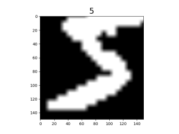

# Loading Image Dataset

`Linux` `Ascend` `GPU` `CPU` `Data Preparation` `Beginner` `Intermediate` `Expert`

<!-- TOC -->

- [Loading Image Dataset](#loading-image-dataset)
    - [Overview](#overview)
    - [Preparations](#preparations)
    - [Loading Dataset](#loading-dataset)
    - [Processing Data](#processing-data)
    - [Augmentation](#augmentation)
    - [References](#references)

<!-- /TOC -->

<a href="https://gitee.com/mindspore/docs/blob/master/tutorials/training/source_en/use/load_dataset_image.md" target="_blank"></a>

## Overview

In computer vision training tasks, it is often difficult to read the entire dataset directly into memory due to memory capacity. The `mindspore.dataset` module provided by MindSpore enables users to customize their data fetching strategy from disk. At the same time, data processing and data augmentation operators are applied to the data. Pipelined data processing produces a continuous flow of data to the training network, improving overall performance.

In addition, MindSpore supports data loading in distributed scenarios. Users can define the number of shards while loading. For more details, see [Loading the Dataset in Data Parallel Mode](https://www.mindspore.cn/tutorial/training/en/master/advanced_use/distributed_training_ascend.html#loading-the-dataset-in-data-parallel-mode).

This tutorial uses the MNIST dataset [1] as an example to demonstrate how to load and process image data using MindSpore.

## Preparations

1. Download and decompress the training [Image](http://yann.lecun.com/exdb/mnist/train-images-idx3-ubyte.gz) and [Label](http://yann.lecun.com/exdb/mnist/train-labels-idx1-ubyte.gz) of the MNIST dataset to `./MNIST` directory. The directory structure is as follows.

    ```text
    └─MNIST
        ├─train-images.idx3-ubyte
        └─train-labels.idx1-ubyte
    ```

2. Import the `mindspore.dataset` module.

    ```python
    import mindspore.dataset as ds
    ```

## Loading Dataset

MindSpore supports loading common datasets in the field of image processing that come in a variety of on-disk formats. Users can also implement custom dataset class to load customized data.

The following tutorial shows how to load the MNIST dataset using the `MnistDataset` in the `mindspore.dataset` module.

1. Configure the dataset directory and create the `MnistDataset`.

    ```python
    DATA_DIR = "./MNIST"
    mnist_dataset = ds.MnistDataset(DATA_DIR, num_samples=6, shuffle=False)
    ```

2. Create an iterator then obtain data through the iterator.

    ```python
    import matplotlib.pyplot as plt

    mnist_it = mnist_dataset.create_dict_iterator()
    data = next(mnist_it)
    plt.imshow(data['image'].asnumpy().squeeze(), cmap=plt.cm.gray)
    plt.title(data['label'].asnumpy(), fontsize=20)
    plt.show()
    ```

    The image is shown below:

    

In addition, users can pass in a sampler to specify the sampling process during dataset loading.

## Processing Data

The following tutorial demonstrates how to construct a pipeline and perform operations such as `shuffle`, `batch` and `repeat` on the MNIST dataset.

```python
for data in mnist_dataset.create_dict_iterator():
    print(data['label'])
```

The output is as follows:

```text
5
0
4
1
9
2
```

1. Shuffle the dataset.

    ```python
    ds.config.set_seed(58)
    ds1 = mnist_dataset.shuffle(buffer_size=6)

    for data in ds1.create_dict_iterator():
        print(data['label'])
    ```

    The output is as follows:

    ```text
    4
    2
    1
    0
    5
    9
    ```

2. Add `batch` after `shuffle`.

    ```python
    ds2 = ds1.batch(batch_size=2)

    for data in ds2.create_dict_iterator():
        print(data['label'])
    ```

    The output is as follows:

    ```text
    [4 2]
    [1 0]
    [5 9]
    ```

3. Add `repeat` after `batch`.

    ```python
    ds3 = ds2.repeat(count=2)

    for data in ds3.create_dict_iterator():
        print(data['label'])
    ```

    The output is as follows:

    ```text
    [4 2]
    [1 0]
    [5 9]
    [2 4]
    [0 9]
    [1 5]
    ```

    The results show the dataset is repeated, and the order of the replica is different from that of the first copy.

    > Having `repeat` in the pipeline results in the execution of repeated operations defined in the entire pipeline, instead of simply copying the current dataset. So the order of the replica is different from that of the first copy after `shuffle`.

## Augmentation

The following tutorial demonstrates how to use the `c_transforms` module to augment data in the MNIST dataset.

1. Import related modules and load the dataset.

    ```python
    from mindspore.dataset.vision import Inter
    import mindspore.dataset.vision.c_transforms as transforms

    mnist_dataset = ds.MnistDataset(DATA_DIR, num_samples=6, shuffle=False)
    ```

2. Define augmentation operators and perform the `Resize` and `RandomCrop` operations on images in the dataset.

    ```python
    resize_op = transforms.Resize(size=(200,200), interpolation=Inter.LINEAR)
    crop_op = transforms.RandomCrop(150)
    transforms_list = [resize_op, crop_op]
    ds4 = mnist_dataset.map(operations=transforms_list, input_columns="image")
    ```

3. Visualize the result of augmentation.

    ```python
    mnist_it = ds4.create_dict_iterator()
    data = next(mnist_it)
    plt.imshow(data['image'].asnumpy().squeeze(), cmap=plt.cm.gray)
    plt.title(data['label'].asnumpy(), fontsize=20)
    plt.show()
    ```

    The original image is scaled up then randomly cropped to 150 x 150.

    

## References

[1] Y. LeCun, L. Bottou, Y. Bengio, and P. Haffner. [Gradient-based learning applied to document recognition](http://yann.lecun.com/exdb/publis/pdf/lecun-98.pdf).
