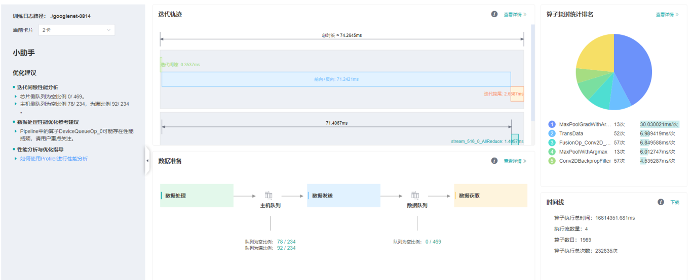
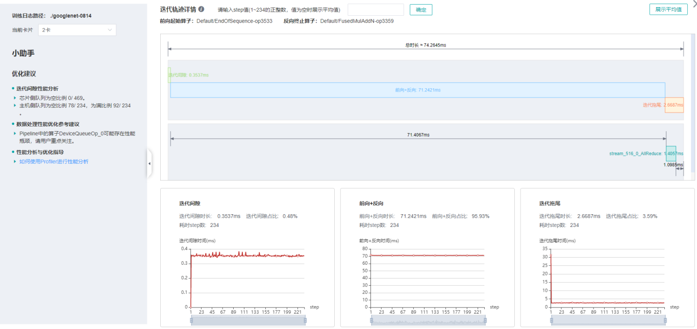
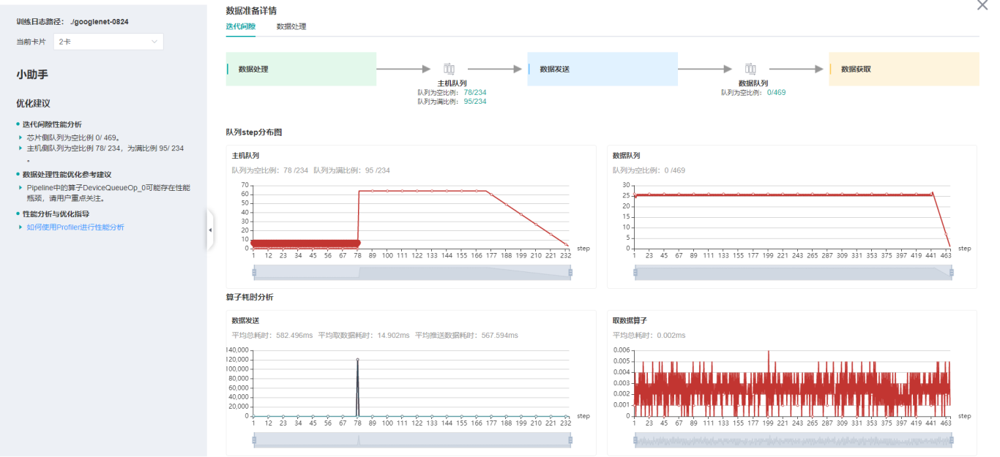
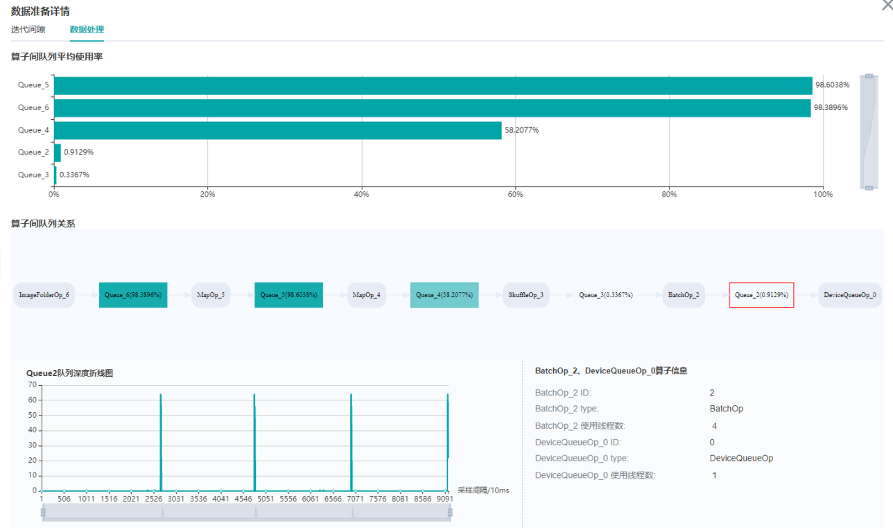

# 性能调试（Ascend）

`Linux` `Ascend` `模型调优` `中级` `高级`

<!-- TOC -->

- [性能调试（Ascend）](#性能调试ascend)
    - [概述](#概述)
    - [操作流程](#操作流程)
    - [准备训练脚本](#准备训练脚本)
    - [启动MindInsight](#启动mindinsight)
        - [性能分析](#性能分析)
            - [迭代轨迹分析](#迭代轨迹分析)
            - [算子性能分析](#算子性能分析)
            - [MindData性能分析](#minddata性能分析)
            - [Timeline分析](#timeline分析)
    - [规格](#规格)

<!-- /TOC -->

<a href="https://gitee.com/mindspore/docs/blob/r1.1/tutorials/training/source_zh_cn/advanced_use/performance_profiling.md" target="_blank"></a>

## 概述

将训练过程中的算子耗时等信息记录到文件中，通过可视化界面供用户查看分析，帮助用户更高效地调试神经网络性能。

## 操作流程

- 准备训练脚本，并在训练脚本中调用性能调试接口，接着运行训练脚本。
- 启动MindInsight，并通过启动参数指定summary-base-dir目录(summary-base-dir是Profiler所创建目录的父目录)，例如训练时Profiler创建的文件夹绝对路径为`/home/user/code/data`，则summary-base-dir设为`/home/user/code`。启动成功后，根据IP和端口访问可视化界面，默认访问地址为 `http://127.0.0.1:8080`。
- 在训练列表找到对应训练，点击性能分析，即可在页面中查看训练性能数据。

## 准备训练脚本

为了收集神经网络的性能数据，需要在训练脚本中添加MindSpore Profiler相关接口。  

- `set_context`之后，初始化网络和HCCL之前，需要初始化MindSpore `Profiler`对象。

  > Profiler支持的参数可以参考：
  >
  > <https://www.mindspore.cn/doc/api_python/zh-CN/r1.1/mindspore/mindspore.profiler.html>

- 在训练结束后，调用`Profiler.analyse()`停止性能数据收集并生成性能分析结果。

样例代码如下：

```python
from mindspore.profiler import Profiler
from mindspore import Model, nn, context


def test_profiler():
    # Init context env
    context.set_context(mode=context.GRAPH_MODE, device_target='Ascend', device_id=int(os.environ["DEVICE_ID"]))

    # Init Profiler
    # Note that 'data' directory is created in current path by default. To visualize the profiling data by MindInsight,
    # 'data' directory should be placed under summary-base-dir.
    profiler = Profiler()

    # Init hyperparameter
    epoch = 2
    # Init network and Model
    net = Net()
    loss_fn = CrossEntropyLoss()
    optim = MyOptimizer(learning_rate=0.01, params=network.trainable_params())
    model = Model(net, loss_fn=loss_fn, optimizer=optim, metrics=None)  
    # Prepare mindrecord_dataset for training
    train_ds = create_mindrecord_dataset_for_training()
    # Model Train
    model.train(epoch, train_ds)

    # Profiler end
    profiler.analyse()
```

## 启动MindInsight

启动命令请参考[MindInsight相关命令](https://www.mindspore.cn/tutorial/training/zh-CN/r1.1/advanced_use/mindinsight_commands.html)。

### 性能分析

用户从训练列表中选择指定的训练，点击性能调试，可以查看该次训练的性能数据。



图1：性能数据总览

图1展示了性能数据总览页面，包含了迭代轨迹（Step Trace）、算子性能、MindData性能和Timeline等组件的数据总体呈现。各组件展示的数据如下：  

- 迭代轨迹：将训练step划分为几个阶段，统计每个阶段的耗时，按时间线进行展示；总览页展示了迭代轨迹图。
- 算子性能：统计单算子以及各算子类型的执行时间，进行排序展示；总览页中展示了各算子类型时间占比的饼状图。
- MindData性能：统计训练数据准备各阶段的性能情况；总览页中展示了各阶段性能可能存在瓶颈的step数目。
- Timeline：按设备统计每个stream中task的耗时情况，在时间轴排列展示；总览页展示了Timeline中stream和task的汇总情况。

用户可以点击查看详情链接，进入某个组件页面进行详细分析。MindInsight也会对性能数据进行分析，在左侧的智能小助手中给出性能调试的建议。

#### 迭代轨迹分析

使用迭代轨迹分析组件可以快速了解训练各阶段在总时长中的占比情况。迭代轨迹将训练的一个step划分为迭代间隙 (两次step执行的间隔时间)、前向与反向执行、all reduce、参数更新等几个阶段，并显示出每个阶段的时长，帮助用户定界出性能瓶颈所在的执行阶段。



图2：迭代轨迹分析

图2展示了迭代轨迹分析页面。在迭代轨迹详情中，会展示各阶段在训练step中的起止时间，默认显示的是各step的平均值，用户也可以在下拉菜单选择某个step查看该step的迭代轨迹情况。  
在页面下方显示了迭代间隙、前后向计算、迭代拖尾时间（前后向计算结束到参数更新完成的时间）随着step的变化曲线等，用户可以据此判断某个阶段是否存在性能优化空间。

迭代轨迹在做阶段划分时，需要识别前向计算开始的算子和反向计算结束的算子。为了降低用户使用Profiler的门槛，MindSpore会对这两个算子做自动识别，方法为：  
前向计算开始的算子指定为`get_next`算子之后连接的第一个算子，反向计算结束的算子指定为最后一次all reduce之前连接的算子。**Profiler不保证在所有情况下自动识别的结果和用户的预期一致，用户可以根据网络的特点自行调整**，调整方法如下：  

- 设置`FP_POINT`环境变量指定前向计算开始的算子，如`export FP_POINT=fp32_vars/conv2d/BatchNorm`。
- 设置`BP_POINT`环境变量指定反向计算结束的算子，如`export BP_POINT=loss_scale/gradients/AddN_70`。

#### 算子性能分析

使用算子性能分析组件可以对MindSpore运行过程中的各个算子的执行时间进行统计展示。


图3：算子类别统计分析

图3展示了按算子类别进行统计分析的结果，包含以下内容：  

- 可以选择饼图/柱状图展示各算子类别的时间占比，每个算子类别的执行时间会统计属于该类别的算子执行时间总和。
- 统计前20个占比时间最长的算子类别，展示其时间所占的百分比以及具体的执行时间（毫秒）。


图4：算子统计分析

图4展示了算子性能统计表，包含以下内容：  

- 选择全部：按单个算子的统计结果进行排序展示，展示维度包括算子名称、算子类型、算子执行时间、算子全scope名称、算子信息等；默认按算子执行时间排序。
- 选择分类：按算子类别的统计结果进行排序展示，展示维度包括算子分类名称、算子类别执行时间、执行频次、占总时间的比例等。点击每个算子类别，可以进一步查看该类别下所有单个算子的统计信息。
- 搜索：在右侧搜索框中输入字符串，支持对算子名称/类别进行模糊搜索。

#### MindData性能分析

使用MindData性能分析组件可以对训练数据准备过程进行性能分析。数据准备过程可以分为三个阶段：数据处理pipeline、数据发送至Device以及Device侧读取训练数据，MindData性能分析组件会对每个阶段的处理性能进行详细分析，并将分析结果进行展示。



图5：MindData性能分析

图5展示了MindData性能分析页面，包含迭代间隙和数据处理两个TAB页面。

迭代间隙TAB页主要用来分析数据准备三个阶段是否存在性能瓶颈，数据队列图是分析判断的重要依据：  

- 数据队列Size代表Device侧从队列取数据时队列的长度，如果数据队列Size为0，则训练会一直等待，直到队列中有数据才会开始某个step的训练；如果数据队列Size大于0，则训练可以快速取到数据，MindData不是该step的瓶颈所在。
- 主机队列Size可以推断出数据处理和发送速度，如果主机队列Size为0，表示数据处理速度慢而数据发送速度快，需要加快数据处理。
- 如果主机队列Size一直较大，而数据队列的Size持续很小，则数据发送有可能存在性能瓶颈。



图6：数据处理pipeline分析

图6展示了数据处理TAB页面，可以对数据处理pipeline做进一步分析。不同的数据算子之间使用队列进行数据交换，队列的长度可以反映出算子处理数据的快慢，进而推断出pipeline中的瓶颈算子所在。

算子队列的平均使用率代表队列中已有数据Size除以队列最大数据Size的平均值，使用率越高说明队列中数据积累越多。算子队列关系展示了数据处理pipeline中的算子以及它们之间的连接情况，点击某个队列可以在下方查看该队列中数据Size随着时间的变化曲线，以及与数据队列连接的算子信息等。对数据处理pipeline的分析有如下建议：  

- 当算子左边连接的Queue使用率都比较高，右边连接的Queue使用率比较低，该算子可能是性能瓶颈。
- 对于最左侧的算子，如果其右边所有Queue的使用率都比较低，该算子可能是性能瓶颈。
- 对于最右侧的算子，如果其左边所有Queue的使用率都比较高，该算子可能是性能瓶颈。

对于不同的类型的MindData算子，有如下优化建议：  

- 如果Dataset算子是性能瓶颈，建议增加`num_parallel_workers`。
- 如果GeneratorOp类型的算子是性能瓶颈，建议增加`num_parallel_workers`，并尝试将其替换为`MindRecordDataset`。
- 如果MapOp类型的算子是性能瓶颈，建议增加`num_parallel_workers`，如果该算子为Python算子，可以尝试优化脚本。
- 如果BatchOp类型的算子是性能瓶颈，建议调整`prefetch_size`的大小。

#### Timeline分析

Timeline组件可以展示：  

- 算子分配到哪个设备（AICPU、AICore等）执行。
- MindSpore对该网络的流切分策略。
- 算子在Device上的执行序列和执行时长。

通过分析Timeline，用户可以对训练过程进行细粒度分析：从High Level层面，可以分析流切分方法是否合理、迭代间隙和拖尾时间是否过长等；从Low Level层面，可以分析算子执行时间等。

用户可以点击总览页面Timeline部分的下载按钮，将Timeline数据文件 (json格式) 保存至本地，再通过工具查看Timeline的详细信息。推荐使用 `chrome://tracing` 或者 [Perfetto](https://ui.perfetto.dev/#!/) 做Timeline展示。  

- Chrome tracing：点击左上角"load"加载文件。
- Perfetto：点击左侧"Open trace file"加载文件。


图7：Timeline分析

Timeline主要包含如下几个部分：  

- Device及其stream list：包含Device上的stream列表，每个stream由task执行序列组成，一个task是其中的一个小方块，大小代表执行时间长短。
- 算子信息：选中某个task后，可以显示该task对应算子的信息，包括名称、type等。

可以使用W/A/S/D来放大、缩小地查看Timeline图信息。

## 规格

- 为了控制性能测试时生成数据的大小，大型网络建议性能调试的step数目限制在10以内。

  > 如何控制step数目请参考数据准备教程：
  >
  > <https://www.mindspore.cn/tutorial/training/zh-CN/r1.1/use/data_preparation.html>

- Timeline数据的解析比较耗时，且一般几个step的数据即足够分析出结果。出于数据解析和UI展示性能的考虑，Profiler最多展示20M数据（对大型网络20M可以显示10+条step的信息）。

## 注意事项

- PyNative模式下暂不支持性能调试。
